# Query Cache Architecture Plan
## Gigentic Escrow - TanStack Query System Design

## Table of Contents
1. [Current State Analysis](#current-state-analysis)
2. [Query Key Architecture](#query-key-architecture)
3. [Cache Organization](#cache-organization)
4. [Invalidation Strategy](#invalidation-strategy)
5. [User Flow Interactions](#user-flow-interactions)
6. [Implementation Recommendations](#implementation-recommendations)

---

## Current State Analysis

### What You Have ✓
- Centralized query key factory (`lib/queries.ts`)
- Hierarchical query key structure
- Query hooks: `useProfile`, `useEscrowDetails`, `useUserEscrows`
- Mutation hooks: `useCreateEscrow`, `useDisputeEscrow`, `useCompleteEscrow`
- Cache invalidation in mutation `onSuccess` handlers
- Parallel queries with `useQueries`

### What Needs Enhancement ⚠️
- Optimistic updates for instant UI feedback
- Block-based cache invalidation for real-time blockchain updates
- Persisted cache for offline support (optional)
- Global cache management utilities

---

## Query Key Architecture

### Hierarchical Query Key Structure

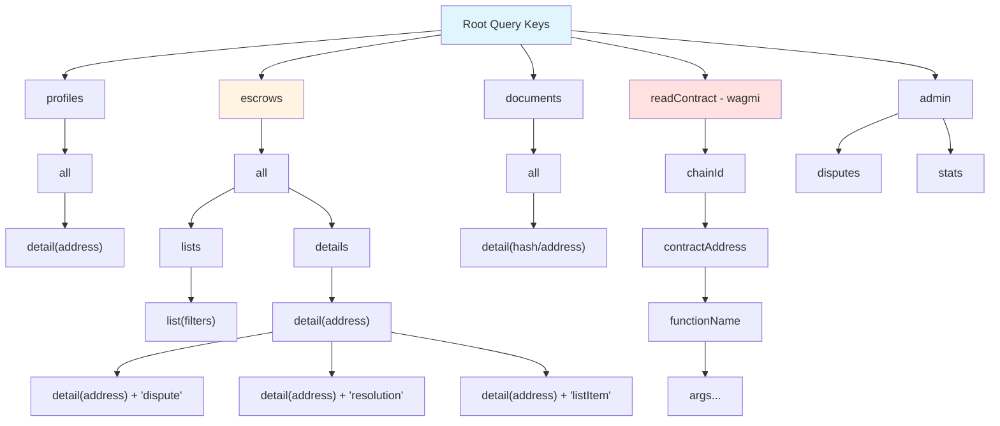

### Enhanced Query Key Factory

```typescript
// lib/queries.ts structure (current + enhanced)
export const queryKeys = {
  // Profile queries (EXISTING)
  profiles: {
    all: ["profiles"] as const,
    detail: (address: Address) => [...queryKeys.profiles.all, address] as const,
  },

  // Escrow queries (ENHANCED)
  escrows: {
    all: ["escrows"] as const,
    lists: () => [...queryKeys.escrows.all, "list"] as const,
    list: (filters?: EscrowFilters) => [...queryKeys.escrows.lists(), filters] as const,
    details: () => [...queryKeys.escrows.all, "detail"] as const,
    detail: (address: Address) => [...queryKeys.escrows.details(), address] as const,
    // Nested queries for specific escrow data
    dispute: (address: Address) => [...queryKeys.escrows.detail(address), "dispute"] as const,
    resolution: (address: Address) => [...queryKeys.escrows.detail(address), "resolution"] as const,
    listItem: (address: Address) => [...queryKeys.escrows.detail(address), "listItem"] as const,
  },

  // Document queries (EXISTING)
  documents: {
    all: ["documents"] as const,
    detail: (hashOrAddress: string) => [...queryKeys.documents.all, hashOrAddress] as const,
  },

  // Contract read queries - wagmi (EXISTING)
  contracts: {
    all: ["readContract"] as const,
    read: (chainId: number, address: Address, functionName: string, args?: readonly unknown[]) =>
      [...queryKeys.contracts.all, chainId, address, functionName, ...(args || [])] as const,
  },

  // Admin queries (EXISTING)
  admin: {
    all: ["admin"] as const,
    disputes: () => [...queryKeys.admin.all, "disputes"] as const,
    stats: () => [...queryKeys.admin.all, "stats"] as const,
  },
};
```

---

## Cache Organization

### Data Flow Architecture

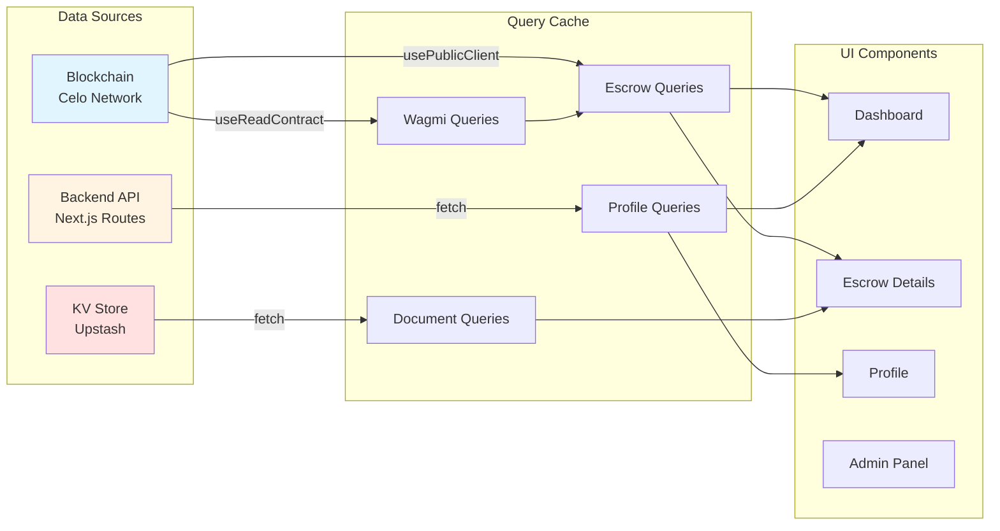

### Cache Configuration Strategy

```typescript
// Recommended cache times by data type
const CACHE_TIMES = {
  // Profile data - medium lived, user controlled
  profile: {
    staleTime: 1000 * 60 * 5,     // Fresh for 5 min
    gcTime: 1000 * 60 * 30,       // Keep in cache for 30 min
  },

  // Escrow data - short lived, blockchain state
  escrowDetails: {
    staleTime: 5_000,              // Fresh for 5 seconds
    gcTime: 1000 * 60 * 10,        // Keep in cache for 10 min
    refetchOnMount: true,
    refetchOnWindowFocus: true,
    refetchInterval: 10_000,       // Poll every 10 seconds when active
  },

  // List data - very short lived, frequently changes
  escrowList: {
    staleTime: 5_000,              // Fresh for 5 seconds
    gcTime: 1000 * 60 * 5,         // Keep in cache for 5 min
    refetchOnMount: true,
    refetchOnWindowFocus: true,
  },

  // Document data - long lived, immutable content
  documents: {
    staleTime: 1000 * 60 * 60,     // Fresh for 1 hour
    gcTime: 1000 * 60 * 60 * 24,   // Keep in cache for 24 hours
  },

  // Contract reads - very short lived, blockchain state
  contractReads: {
    staleTime: 5_000,              // Fresh for 5 seconds
    gcTime: 1000 * 60 * 5,         // Keep in cache for 5 min
    refetchOnMount: true,
  },
};
```

---

## Invalidation Strategy

### Cache Invalidation Flow

```mermaid
graph TD
    A[User Action] --> B{Mutation Type}

    B -->|Update Profile| C[Profile Mutation]
    B -->|Create Escrow| D[Escrow Creation]
    B -->|Dispute| E[Dispute Mutation]
    B -->|Complete| F[Complete Mutation]
    B -->|Resolve| G[Resolve Mutation]
    B -->|Sign Out| H[Disconnect Wallet]

    C --> C1["Invalidate: profiles.detail(address)"]
    C --> C2["Set: new profile data"]

    D --> D1["Invalidate: ALL readContract"]
    D --> D2["Invalidate: getUserEscrows query"]
    D --> D3["Invalidate: escrows.lists()"]
    D --> D4["Wait 500ms for chain propagation"]
    D --> D5["Navigate to new escrow"]

    E --> E1["Invalidate: escrows.detail(address)"]
    E --> E2["Invalidate: dispute sub-query"]
    E --> E3["Invalidate: documents.detail()"]
    E --> E4["Invalidate: readContract"]
    E --> E5["Wait 1000ms for propagation"]
    E --> E6["Refetch: all escrow queries"]

    F --> F1["Invalidate: escrows.detail(address)"]
    F --> F2["Invalidate: dispute sub-query"]
    F --> F3["Invalidate: readContract"]
    F --> F4["Wait 1000ms for propagation"]
    F --> F5["Refetch: all escrow queries"]

    G --> G1["Invalidate: escrows.detail(address)"]
    G --> G2["Invalidate: resolution sub-query"]
    G --> G3["Invalidate: admin.disputes()"]
    G --> G4["Invalidate: readContract"]

    H --> H1["Clear: profiles.detail()"]
    H --> H2["Clear: escrows.lists()"]
    H --> H3["Disconnect wallet"]
    H --> H4["Clear session cookie via API"]

    style A fill:#e1f5ff
    style D fill:#fff4e1
    style E fill:#ffe1f1
    style F fill:#e1ffe1
```

### Invalidation Patterns by Scope

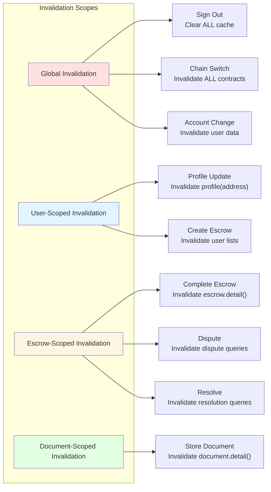

---

## User Flow Interactions

### 1. Authentication Flow

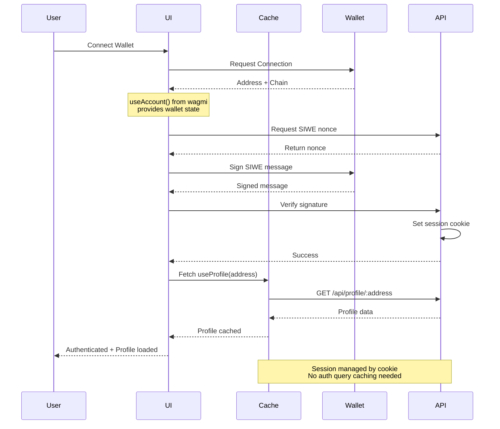

### 2. Dashboard Flow

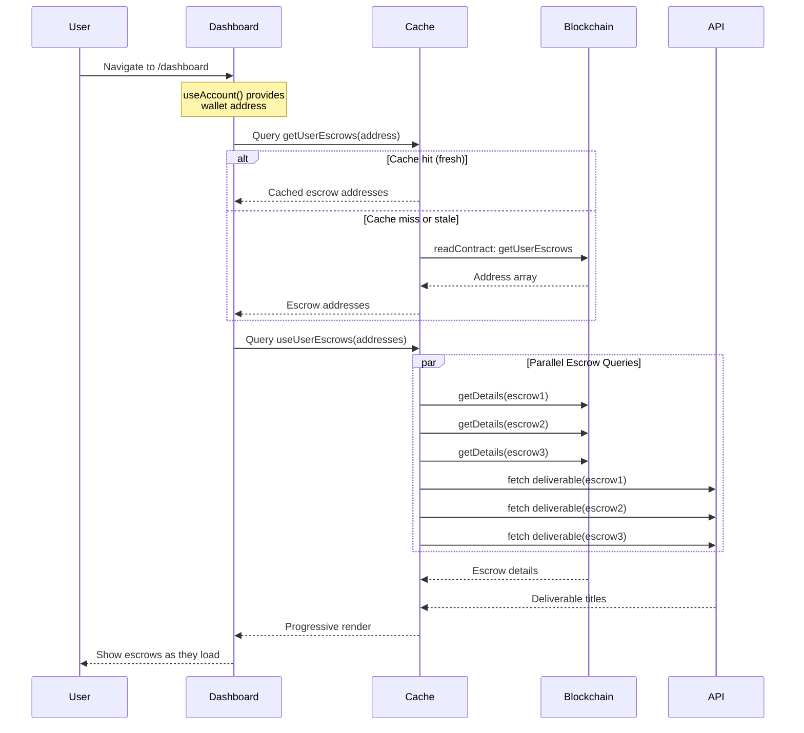

### 3. Create Escrow Flow

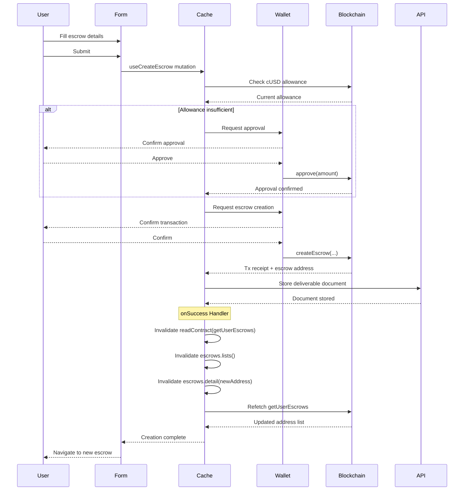

### 4. Dispute Flow

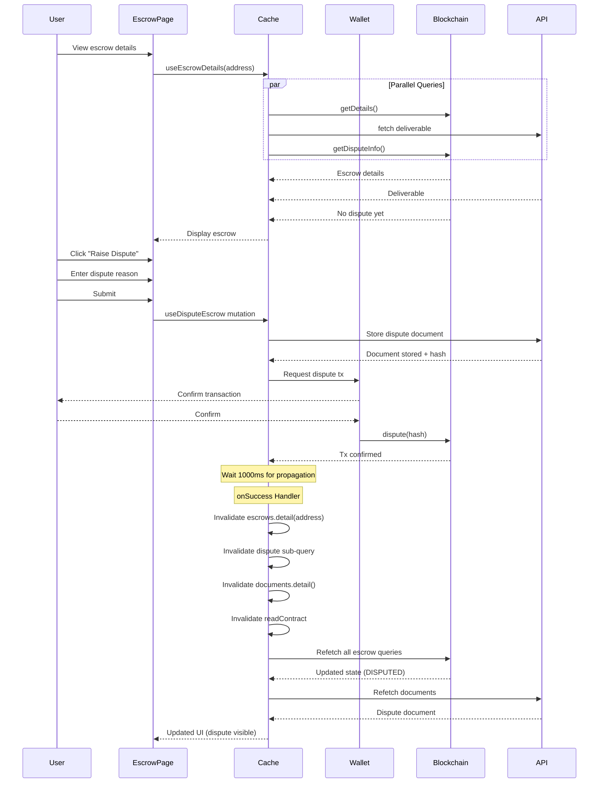

### 5. Complete Escrow Flow

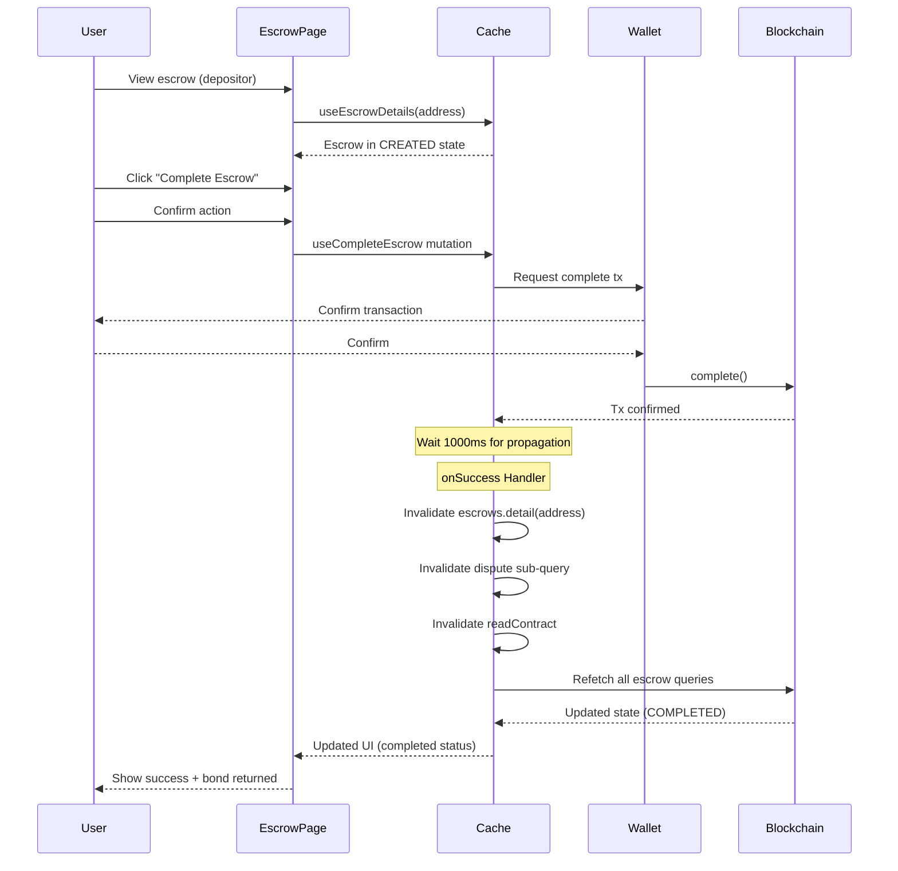

### 6. Sign Out Flow

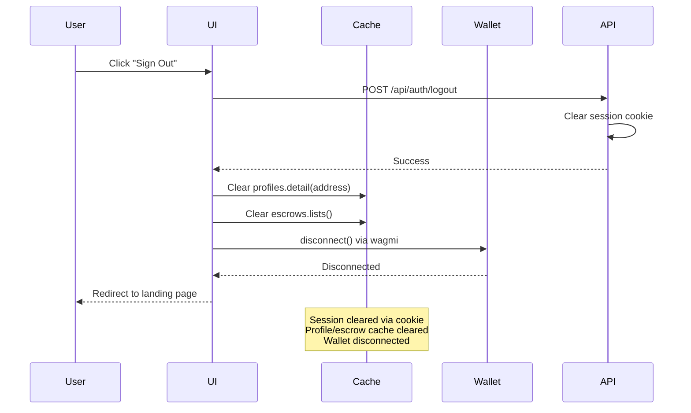

---

## Implementation Recommendations

### 1. Add Global Cache Utilities

```typescript
// lib/cache-utils.ts (NEW)
import { QueryClient } from '@tanstack/react-query';
import { queryKeys } from './queries';
import type { Address } from 'viem';

export class CacheManager {
  constructor(private queryClient: QueryClient) {}

  /**
   * Clear all user-specific data on sign out or account change
   */
  clearUserData(address: Address) {
    this.queryClient.removeQueries({ queryKey: queryKeys.profiles.detail(address) });
    this.queryClient.removeQueries({ queryKey: queryKeys.escrows.lists() });
  }

  /**
   * Invalidate all blockchain data (for chain switches or reconnects)
   */
  async invalidateBlockchainData() {
    await this.queryClient.invalidateQueries({ queryKey: queryKeys.contracts.all });
    await this.queryClient.invalidateQueries({ queryKey: queryKeys.escrows.all });
  }

  /**
   * Invalidate all queries for a specific escrow
   */
  async invalidateEscrow(address: Address) {
    await this.queryClient.invalidateQueries({
      queryKey: queryKeys.escrows.detail(address),
      exact: false, // Include all nested queries
    });
  }

  /**
   * Optimistically update an escrow's state
   */
  setEscrowStateOptimistic(address: Address, newState: number) {
    this.queryClient.setQueryData(
      queryKeys.escrows.detail(address),
      (old: any) => {
        if (!old) return old;
        return { ...old, state: newState };
      }
    );
  }

  /**
   * Prefetch escrow details before navigation
   */
  async prefetchEscrow(address: Address, publicClient: any) {
    await this.queryClient.prefetchQuery({
      queryKey: queryKeys.escrows.detail(address),
      queryFn: async () => {
        const details = await publicClient.readContract({
          address,
          abi: ESCROW_CONTRACT_ABI,
          functionName: 'getDetails',
        });
        return parseEscrowDetails(details);
      },
    });
  }
}

// Export singleton instance
export const createCacheManager = (queryClient: QueryClient) =>
  new CacheManager(queryClient);
```

### 2. Add Optimistic Updates

```typescript
// Enhanced mutation with optimistic update
export function useCompleteEscrow(options?: {
  onSuccess?: (data: { txHash: `0x${string}` }, escrowAddress: Address) => void;
  onError?: (error: Error) => void;
}) {
  const publicClient = usePublicClient();
  const { writeContractAsync } = useWriteContract();
  const queryClient = useQueryClient();

  const mutation = useMutation({
    mutationFn: async (escrowAddress: Address) => {
      // ... existing mutation logic
    },

    // NEW: Optimistic update
    onMutate: async (escrowAddress) => {
      // Cancel outgoing refetches
      await queryClient.cancelQueries({
        queryKey: queryKeys.escrows.detail(escrowAddress),
      });

      // Snapshot current value
      const previousDetails = queryClient.getQueryData(
        queryKeys.escrows.detail(escrowAddress)
      );

      // Optimistically update to COMPLETED state (3)
      queryClient.setQueryData(
        queryKeys.escrows.detail(escrowAddress),
        (old: any) => {
          if (!old) return old;
          return { ...old, state: 3 }; // 3 = COMPLETED
        }
      );

      // Return context with snapshot
      return { previousDetails };
    },

    // NEW: Rollback on error
    onError: (error, escrowAddress, context) => {
      // Rollback to previous value
      if (context?.previousDetails) {
        queryClient.setQueryData(
          queryKeys.escrows.detail(escrowAddress),
          context.previousDetails
        );
      }

      if (options?.onError) {
        options.onError(error);
      }
    },

    onSuccess: async (data, escrowAddress) => {
      // ... existing success logic
    },
  });

  return mutation;
}
```

### 3. Add Block-Based Invalidation

```typescript
// hooks/use-block-watcher.ts (NEW)
import { useBlockNumber } from 'wagmi';
import { useQueryClient } from '@tanstack/react-query';
import { useEffect, useRef } from 'react';
import { queryKeys } from '@/lib/queries';

/**
 * Watch for new blocks and invalidate escrow queries
 * This ensures UI stays in sync with blockchain state
 */
export function useBlockWatcher(enabled = true) {
  const { data: blockNumber } = useBlockNumber({
    watch: enabled,
    pollingInterval: 5_000, // Check every 5 seconds
  });
  const queryClient = useQueryClient();
  const previousBlock = useRef<bigint>();

  useEffect(() => {
    if (!blockNumber || !enabled) return;

    // Skip first run
    if (previousBlock.current === undefined) {
      previousBlock.current = blockNumber;
      return;
    }

    // New block detected
    if (blockNumber !== previousBlock.current) {
      console.log(`New block: ${blockNumber}`);

      // Invalidate all escrow queries (they may have changed)
      queryClient.invalidateQueries({
        queryKey: queryKeys.escrows.all,
        refetchType: 'active', // Only refetch active queries
      });

      // Invalidate contract reads
      queryClient.invalidateQueries({
        queryKey: queryKeys.contracts.all,
        refetchType: 'active',
      });

      previousBlock.current = blockNumber;
    }
  }, [blockNumber, enabled, queryClient]);
}
```

### 4. Add Cache Persistence (Optional)

```typescript
// lib/query-client.ts
import { QueryClient } from '@tanstack/react-query';
import { createSyncStoragePersister } from '@tanstack/query-sync-storage-persister';
import { PersistQueryClientProvider } from '@tanstack/react-query-persist-client';

export function createQueryClient() {
  return new QueryClient({
    defaultOptions: {
      queries: {
        gcTime: 1000 * 60 * 60 * 24, // 24 hours
      },
    },
  });
}

export const persister = createSyncStoragePersister({
  storage: typeof window !== 'undefined' ? window.localStorage : undefined,
  key: 'gigentic-query-cache',
  serialize: (data) => JSON.stringify(data),
  deserialize: (data) => JSON.parse(data),
});

// Use in wallet-provider.tsx:
// <PersistQueryClientProvider
//   client={queryClient}
//   persistOptions={{ persister }}
// >
//   {children}
// </PersistQueryClientProvider>
```

### 5. Add Query Devtools Setup

```typescript
// components/query-devtools.tsx (NEW)
'use client';

import { ReactQueryDevtools } from '@tanstack/react-query-devtools';

export function QueryDevtools() {
  return (
    <ReactQueryDevtools
      initialIsOpen={false}
      position="bottom-right"
      buttonPosition="bottom-right"
    />
  );
}

// Add to layout.tsx:
// {process.env.NODE_ENV === 'development' && <QueryDevtools />}
```

---

## Summary

### Key Principles

1. **Hierarchical Query Keys**: Use nested keys for easy invalidation
2. **Granular Invalidation**: Only invalidate what changed
3. **Optimistic Updates**: Update UI immediately, rollback on error
4. **Progressive Loading**: Show data as it arrives
5. **Block Watching**: Auto-refresh on new blocks
6. **Cache Persistence**: Save cache to localStorage (optional)
7. **Type Safety**: Use TypeScript for all query keys and data

### Data Flow Patterns

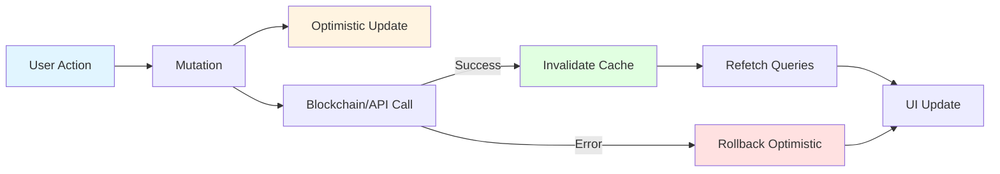

### Cache Invalidation Decision Tree

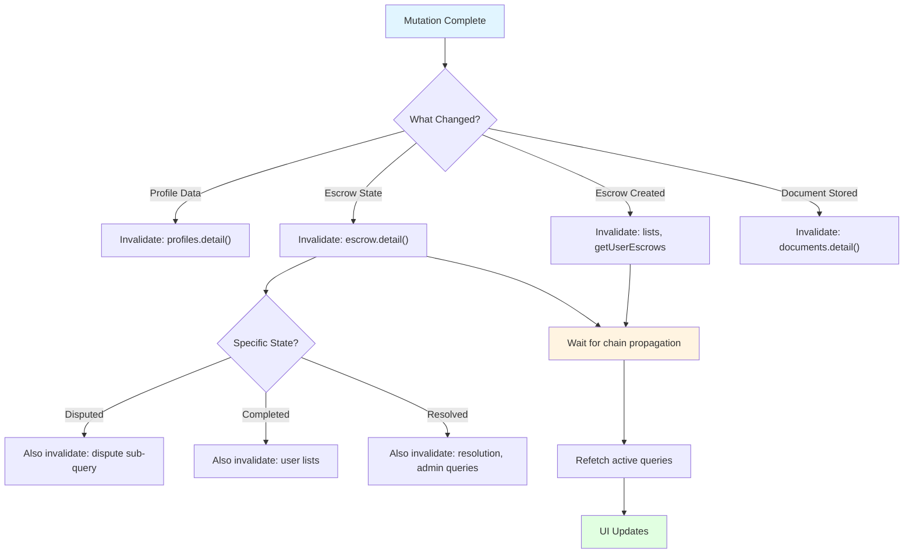

---

## Next Steps

1. ✅ Review this architecture with your team
2. [ ] Add `cache-utils.ts` utilities
3. [ ] Enhance mutation hooks with optimistic updates
4. [ ] Add `use-block-watcher.ts` for real-time updates
5. [ ] Consider cache persistence for offline support (optional)
6. [ ] Add React Query Devtools for debugging
7. [ ] Update all mutation hooks to use new invalidation patterns
8. [ ] Test cache invalidation flows thoroughly
9. [ ] Monitor cache performance and adjust stale times

---

**Last Updated**: 2025-10-27
**Version**: 1.0
**Author**: Claude Code
