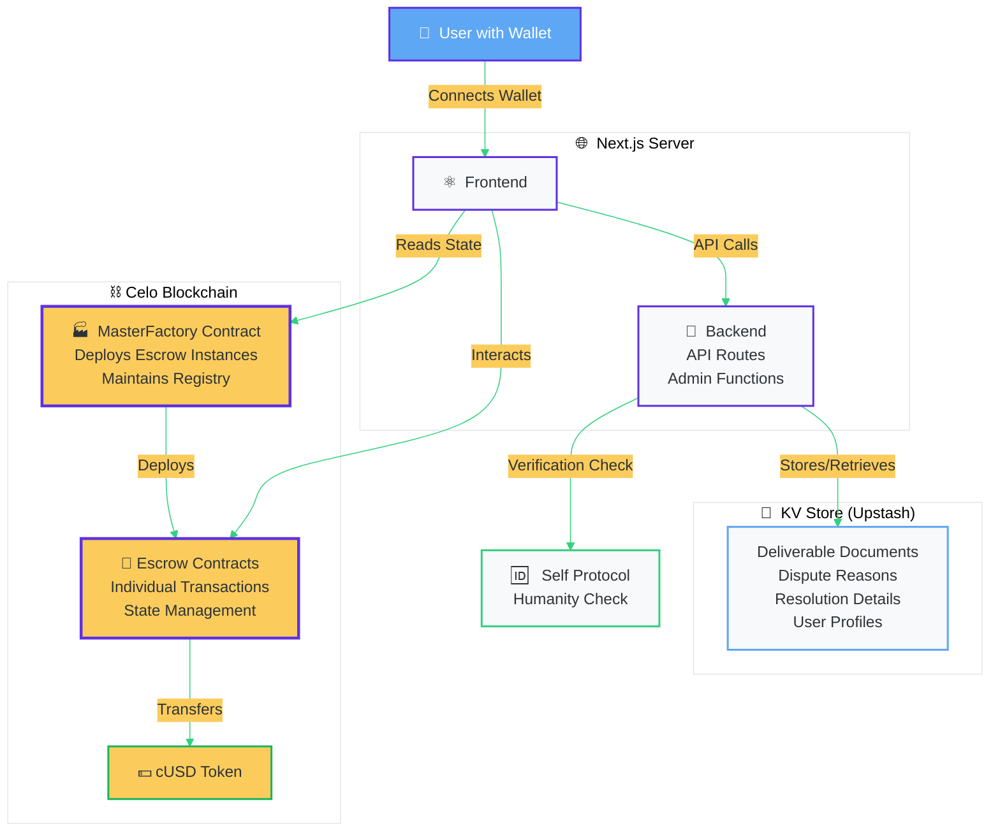
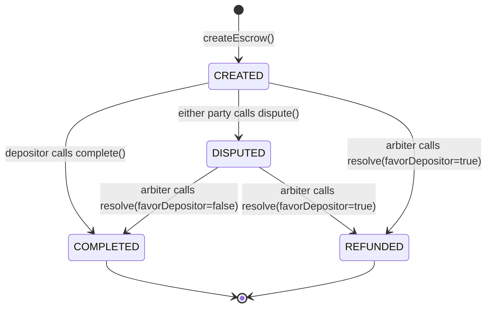

# CheckPay

> **Decentralized Escrow Protocol for Emerging Markets**

CheckPay is a trustless peer-to-peer escrow protocol built on Celo blockchain, designed to enable secure transactions in emerging markets without requiring traditional banking infrastructure. Combining smart contract-based escrow with optional identity verification (Self Protocol) and admin-controlled dispute resolution, CheckPay is optimized for mobile-first users via MiniPay and Valora wallets.

[](LICENSE)
[](https://docs.celo.org)
[](https://soliditylang.org)
[](https://nextjs.org)

---

## 📋 Table of Contents

- [Overview](#overview)
- [Key Features](#key-features)
- [Use Cases](#use-cases)
- [Tech Stack](#tech-stack)
- [Architecture](#architecture)
- [Quick Start](#quick-start)
- [Project Structure](#project-structure)
- [Smart Contracts](#smart-contracts)
- [Development](#development)
- [Deployment](#deployment)
- [Contributing](#contributing)
- [Supported Networks](#supported-networks)
- [Resources](#resources)
- [License](#license)

---

## 🌍 Overview

CheckPay addresses trust barriers in digital transactions by providing a decentralized escrow solution for underserved markets. Built on Celo's carbon-negative, mobile-first blockchain, CheckPay enables freelancers, micro-merchants, and cross-border traders to transact safely using cUSD (Celo Dollar) stablecoin.

### The Problem

In emerging markets, lack of traditional banking infrastructure and trust mechanisms creates significant friction for digital commerce. Freelancers risk non-payment, buyers fear non-delivery, and both parties lack recourse in disputes.

### The Solution

CheckPay provides:
- **Smart Contract Escrow**: Trustless fund locking until delivery confirmation
- **Stable Currency**: All transactions in cUSD to avoid crypto volatility
- **Dispute Resolution**: Admin-controlled arbiter system with transparent resolution
- **Identity Layer**: Optional Self Protocol verification for enhanced trust
- **Mobile-First**: Optimized for low-bandwidth environments and basic mobile devices

### Business Model

- **Platform Fee**: 1% on all escrow transactions
- **Dispute Bond**: 4% refundable bond (forfeited by losing party in disputes)
- **Future Revenue**: Premium services, whitelabeled solutions, third-party integrations

---

## ✨ Key Features

### Smart Contract Features

#### 🏭 Factory Pattern Architecture
- **MasterFactory Contract**: Deploys individual escrow instances on-demand
- **Escrow Registry**: Maintains list of all escrows and user-specific escrows
- **Arbiter Configuration**: Admin-controlled dispute resolution authority
- **Global Statistics**: Tracks platform-wide volume and fees

#### 🔄 Four-State Escrow Lifecycle
```
CREATED ──────→ COMPLETED (funds to recipient)
   │
   └→ DISPUTED ──→ COMPLETED (arbiter favors recipient)
                  └→ REFUNDED (arbiter favors depositor)
```

- **CREATED**: Funds locked, awaiting completion or dispute
- **DISPUTED**: Dispute raised by either party, arbiter reviews
- **COMPLETED**: Funds released to recipient, dispute bond returned to depositor
- **REFUNDED**: Funds returned to depositor, dispute bond returned

#### ⚖️ Dispute Resolution
- **Either Party Can Dispute**: Depositor or recipient can raise concerns
- **Hash-Based Documentation**: Dispute reasons and deliverables referenced by hash
- **Arbiter Review**: Admin-designated arbiter reviews evidence
- **Flexible Resolution**: Arbiter can favor depositor (refund) or recipient (complete)
- **Bond Forfeiture**: Losing party forfeits 4% dispute bond to winner

#### 💰 Fee Structure
- **Platform Fee**: 1% of escrow amount (sent to factory owner)
- **Dispute Bond**: 4% of escrow amount (refundable)
- **Total Required**: `amount + 1% fee + 4% bond = amount × 1.05`
- **Currency**: All amounts in cUSD (Celo Dollar)

#### 🛡️ Security Features
- **ReentrancyGuard**: Protection against reentrancy attacks on all state-changing functions
- **SafeERC20**: Secure token transfers with proper error handling
- **Immutable Parameters**: Depositor, recipient, and amounts cannot be changed
- **Access Control**: Role-based permissions for arbiter and admin functions
- **Hash-Based Storage**: Deliverable and dispute documentation stored off-chain with on-chain hash verification


### Platform Features

#### 📱 Mobile-First Design
- Responsive layout optimized for smartphones and tablets
- Low-bandwidth friendly (optimized asset loading)
- Touch-friendly UI components
- Dark/light theme support

#### 👛 Multi-Wallet Support
- **MetaMask**: Browser extension and mobile app
- **MiniPay**: Opera's built-in crypto wallet
- **Valora**: Native Celo mobile wallet
- **RainbowKit Integration**: Beautiful wallet connection UI
- **Auto-Logout**: Detects wallet address changes and prompts re-authentication

#### 🆔 Identity Verification (Optional)
- **Self Protocol Integration**: Privacy-preserving human verification
- **QR Code Flow**: Simple mobile verification process
- **Visual Badges**: Verified users display trust signals
- **Off-Chain Storage**: Verification status stored in Redis (not enforced on-chain)
- **Enhanced Trust**: Helps establish credibility in peer-to-peer transactions


#### 🎯 Core User Flows

**Create Escrow**
- Define deliverable with title, description, and acceptance criteria
- Set escrow amount with live fee calculation
- Specify recipient wallet address
- One-click cUSD approval and escrow creation
- Category tagging for organization

**Escrow Details**
- Complete escrow information with timeline
- Deliverable details and acceptance criteria
- Dispute information (if raised)
- Resolution details (if resolved)
- Actions available based on role and state

**Actions**
- **Complete Escrow** (depositor): Release funds when satisfied
- **Raise Dispute** (either party): Document concerns with detailed explanation
- **View Deliverable**: Access promised work details
- **View Dispute**: Review dispute documentation (authorized parties only)

**Profile**
- View Self Protocol verification status
- Transaction history and statistics
- Verification badge for identity-verified users

**Admin Panel** (Arbiters Only)
- Dispute dashboard with filtering
- Review deliverable and dispute documentation
- AI-assisted evidence analysis
- Resolve disputes with transparent reasoning
- Platform statistics and analytics


---

## 🎯 Use Cases

### 1. Freelance Payments
**Scenario**: Designer in Nigeria working for client in USA
- Client creates escrow with design requirements and payment amount
- Designer submits work
- Client reviews and completes escrow (funds released to designer)
- If dispute: Admin reviews portfolio and requirements, resolves fairly

### 2. P2P Marketplace Transactions
**Scenario**: Seller on local marketplace selling used electronics
- Buyer creates escrow before meeting
- Parties meet, buyer inspects item
- Buyer completes escrow from mobile phone
- Seller receives payment instantly

### 3. Cross-Border Trade
**Scenario**: SME importer purchasing goods from overseas supplier
- Importer creates escrow with delivery terms
- Supplier ships goods with tracking
- Importer confirms receipt and completes escrow
- Stable cUSD eliminates currency volatility risk

### 4. Gig Economy Platforms
**Scenario**: Platform connecting workers with tasks
- Platform integrates CheckPay SDK
- Automatic escrow creation for each gig
- Workers protected from non-payment
- Employers protected from non-completion

---

## 🏗️ Architecture



## 🛠️ Tech Stack

### Smart Contracts
- **Solidity**: 0.8.28
- **Development Framework**: Hardhat with Viem
- **Security**: OpenZeppelin Contracts (ReentrancyGuard, SafeERC20)
- **Testing**: Hardhat with Chai assertions
- **Deployment**: Hardhat Ignition modules
- **Verification**: Celoscan API integration

### Frontend
- **Framework**: Next.js 14 (App Router)
- **Language**: TypeScript 5.2+
- **UI Library**: React 18
- **Styling**: Tailwind CSS 3.x
- **Components**: shadcn/ui (Radix UI primitives)
- **Forms**: React Hook Form with Zod validation

### Blockchain Integration
- **Wallet Connection**: RainbowKit 2.x
- **React Hooks**: Wagmi v2
- **Ethereum Library**: Viem (typed, lightweight)
- **Network**: Celo (Mainnet & Sepolia Testnet)
- **Token**: cUSD (Celo Dollar stablecoin)

### Infrastructure
- **Monorepo**: Turborepo
- **Package Manager**: PNPM 10.x
- **State Management**: React Context + TanStack React Query
- **Authentication**: NextAuth.js (wallet-based)
- **KV Storage**: Upstash Redis
- **Identity**: Self Protocol SDK

### Development Tools
- **Type Checking**: TypeScript strict mode
- **Linting**: ESLint with Next.js config
- **Formatting**: Prettier (recommended)
- **Testing**: Hardhat for contracts, Playwright for E2E (planned)


---

## 🚀 Quick Start

### Prerequisites

- **Node.js**: 18.0.0 or higher
- **PNPM**: 8.0.0 or higher
- **Celo Wallet**: Valora, MiniPay, or MetaMask configured for Celo

### Installation

1. **Clone the repository**
   ```bash
   git clone https://github.com/YOUR_USERNAME/gigentic-escrow-minipay.git
   cd gigentic-escrow-minipay
   ```

2. **Install dependencies**
   ```bash
   pnpm install
   ```

3. **Configure Smart Contracts**

   Copy the example environment file and fill in your values:
   ```bash
   cp apps/contracts/.env.example apps/contracts/.env
   ```

   Then edit `apps/contracts/.env` with:
   - `PRIVATE_KEY`: Your deployment wallet private key (⚠️ **NEVER commit this**)
   - `CELOSCAN_API_KEY`: Get from [Celoscan](https://celoscan.io/apis) for contract verification
   - Optional: Custom RPC URLs (defaults provided in config)

4. **Configure Frontend**

   Copy the example environment file and fill in your values:
   ```bash
   cp apps/web/.env.example apps/web/.env.local
   ```

### Development

1. **Compile smart contracts**
   ```bash
   pnpm contracts:compile
   ```

2. **Run smart contract tests**
   ```bash
   pnpm contracts:test
   ```

3. **Deploy to local network** (optional)
   ```bash
   # Terminal 1: Start local Hardhat node
   cd apps/contracts
   pnpm exec hardhat node

   # Terminal 2: Deploy contracts
   pnpm contracts:deploy
   ```

4. **Deploy to Celo Sepolia Testnet**
   ```bash
   pnpm contracts:deploy:sepolia
   ```

   Copy the deployed `MasterFactory` address to `NEXT_PUBLIC_MASTER_FACTORY_ADDRESS` in `apps/web/.env.local`

5. **Start development server**
   ```bash
   pnpm dev
   ```

   This starts both the Next.js frontend (http://localhost:3000) and watches for contract changes.

6. **Open in browser**
   ```
   http://localhost:3000
   ```

### Testing the Flow

1. **Connect Wallet**: Click "Connect Wallet" and choose Valora/MiniPay/MetaMask
2. **Get Testnet cUSD**: Use [Celo Faucet](https://faucet.celo.org/) to get testnet tokens
3. **Create Escrow**:
   - Fill in deliverable details
   - Set amount (e.g., 10 cUSD)
   - Enter recipient address
   - Approve cUSD spending
   - Confirm escrow creation
4. **View Dashboard**: See your escrow in "As Depositor" view
5. **Complete/Dispute**: Test escrow actions from both depositor and recipient accounts

---

## 📦 Project Structure

### Monorepo Organization

This project uses **Turborepo** to manage a monorepo with two main applications:

- **`apps/contracts`**: Hardhat smart contract development environment
- **`apps/web`**: Next.js frontend application
```
gigentic-escrow-minipay/
├── apps/
│   ├── contracts/          # Smart contract development
│   │   ├── contracts/      # Solidity contracts
│   │   │   ├── MasterFactory.sol      # Factory & registry
│   │   │   ├── EscrowContract.sol     # Individual escrow logic
│   │   │   └── MockCUSD.sol           # Testing token
│   │   ├── test/           # Comprehensive test suite (1,394 lines)
│   │   ├── ignition/       # Deployment modules
│   │   │   └── modules/
│   │   │       └── MasterFactory.ts
│   │   ├── hardhat.config.ts          # Network configs
│   │   └── package.json
│   │
│   └── web/                # Next.js frontend application
│       ├── src/
│       │   ├── app/        # Next.js App Router pages
│       │   │   ├── page.tsx                  # Landing page
│       │   │   ├── dashboard/                # User dashboard
│       │   │   ├── create/                   # Create escrow
│       │   │   ├── escrow/[address]/         # Escrow details
│       │   │   ├── profile/[address]/        # User profile
│       │   │   └── admin/                    # Admin dispute panel
│       │   │
│       │   ├── components/ # React components
│       │   │   ├── escrow/              # Escrow-specific
│       │   │   │   ├── escrow-card.tsx
│       │   │   │   ├── escrow-list.tsx
│       │   │   │   ├── escrow-details.tsx
│       │   │   │   └── escrow-actions.tsx
│       │   │   ├── wallet/              # Wallet integration
│       │   │   │   └── wallet-provider.tsx
│       │   │   ├── profile/             # User profiles
│       │   │   ├── navbar.tsx           # Navigation
│       │   │   └── ui/                  # shadcn/ui components
│       │   │
│       │   ├── hooks/      # Custom React hooks (17+)
│       │   │   ├── use-user-escrows.ts       # Fetch user's escrows
│       │   │   ├── use-escrow-details.ts     # Fetch escrow data
│       │   │   ├── use-escrow-filters.ts     # Filter/sort logic
│       │   │   ├── use-complete-escrow.ts    # Complete mutation
│       │   │   ├── use-dispute-escrow.ts     # Dispute mutation
│       │   │   └── use-require-auth.ts       # Auth guard
│       │   │
│       │   ├── lib/        # Utilities and configs
│       │   │   ├── escrow-config.ts          # ABIs, addresses, enums
│       │   │   ├── address-utils.ts          # Address comparison
│       │   │   ├── format-utils.ts           # Formatting helpers
│       │   │   ├── hash.ts                   # Hashing utilities
│       │   │   ├── types.ts                  # TypeScript types
│       │   │   └── utils.ts                  # General utilities
│       │   │
│       │   └── api/        # API routes
│       │       └── documents/                # Deliverable/dispute docs
│       │
│       ├── public/         # Static assets
│       └── package.json
│
├── turbo.json              # Turborepo configuration
├── package.json            # Root package configuration
└── pnpm-workspace.yaml     # PNPM workspace config
```

---

## 📝 Smart Contracts


**State Machine**



**Factory Pattern with Registry**

```
┌─────────────────────────────────────────┐
│         MasterFactory                   │
│  ┌───────────────────────────────────┐  │
│  │ • Deploy new escrow instances     │  │
│  │ • Maintain escrow registry        │  │
│  │ • Configure arbiter               │  │
│  │ • Collect platform fees           │  │
│  │ • Track global statistics         │  │
│  └───────────────────────────────────┘  │
└──────────────┬──────────────────────────┘
               │ deploys
               ▼
┌──────────────────────────────────────────┐
│         EscrowContract (Instance)        │
│  ┌────────────────────────────────────┐  │
│  │ Immutable State:                   │  │
│  │  • depositor address               │  │
│  │  • recipient address               │  │
│  │  • escrowAmount                    │  │
│  │  • platformFee                     │  │
│  │  • disputeBond                     │  │
│  │                                    │  │
│  │ Mutable State:                     │  │
│  │  • state (enum)                    │  │
│  │  • deliverableHash                 │  │
│  │  • disputeReasonHash               │  │
│  │  • resolutionHash                  │  │
│  └────────────────────────────────────┘  │
└──────────────────────────────────────────┘
```

### MasterFactory.sol

**Purpose**: Factory contract that deploys and manages individual escrow instances.

**Key Functions**:

```solidity
function createEscrow(
    address recipient,
    uint256 escrowAmount,
    bytes32 deliverableHash
) external returns (address)
```
- Creates new escrow instance
- Transfers `amount + fee + bond` from msg.sender
- Stores escrow in registry
- Emits `EscrowCreated` event
- Returns escrow contract address

```solidity
function getUserEscrows(address user) external view returns (address[] memory)
```
- Returns all escrows where user is depositor or recipient
- Used by dashboard to fetch user's escrows

```solidity
function setArbiter(address newArbiter) external onlyOwner
```
- Admin function to designate dispute arbiter
- Only callable by factory owner

**Deployment**: Deployed once per network, address stored in frontend config

**Addresses**:
- Celo Mainnet: `TBD`
- Celo Sepolia: `TBD`

### EscrowContract.sol

**Purpose**: Individual escrow instance managing a single transaction.

**State Variables**:
```solidity
address public immutable depositor;
address public immutable recipient;
uint256 public immutable escrowAmount;
uint256 public immutable platformFee;
uint256 public immutable disputeBond;
EscrowState public state;  // CREATED, DISPUTED, COMPLETED, REFUNDED
bytes32 public deliverableHash;
```

**Key Functions**:

```solidity
function complete() external onlyDepositor onlyInState(EscrowState.CREATED)
```
- Depositor releases funds when satisfied
- Transfers `escrowAmount` to recipient
- Returns `disputeBond` to depositor
- Sets state to `COMPLETED`

```solidity
function dispute(bytes32 disputeReasonHash) external onlyParty onlyInState(EscrowState.CREATED)
```
- Either party raises a dispute
- Stores hash of dispute documentation
- Sets state to `DISPUTED`
- Arbiter can now resolve

```solidity
function resolve(
    bool favorDepositor,
    bytes32 resolutionHash
) external onlyArbiter onlyInState(EscrowState.DISPUTED)
```
- Arbiter resolves dispute
- If `favorDepositor == true`: Refund to depositor, bond to depositor
- If `favorDepositor == false`: Pay recipient, bond to recipient
- Stores resolution hash for transparency

**Security**:
- All state-changing functions protected by `ReentrancyGuard`
- Uses `SafeERC20` for token transfers
- Access control modifiers for role-based permissions
- Immutable critical parameters prevent tampering

### Fee Calculation

```typescript
// Helper function (lib/escrow-config.ts)
function calculateTotalRequired(escrowAmount: bigint) {
  const platformFee = (escrowAmount * 1n) / 100n;  // 1%
  const disputeBond = (escrowAmount * 4n) / 100n;  // 4%
  const total = escrowAmount + platformFee + disputeBond;

  return { escrowAmount, platformFee, disputeBond, total };
}
```

**Example Calculations**:
- 100 cUSD escrow → 1 cUSD fee + 4 cUSD bond = **105 cUSD total**
- 1000 cUSD escrow → 10 cUSD fee + 40 cUSD bond = **1050 cUSD total**
- 50 cUSD escrow → 0.5 cUSD fee + 2 cUSD bond = **52.5 cUSD total**

---

## 🔧 Development

### Available Commands

**Root Level** (affects all packages):
```bash
pnpm install          # Install all dependencies
pnpm dev              # Start all dev servers
pnpm build            # Build all packages
pnpm lint             # Lint all packages
pnpm type-check       # TypeScript type checking
pnpm clean            # Clean build artifacts
```

**Smart Contracts**:
```bash
pnpm contracts:compile              # Compile Solidity contracts
pnpm contracts:test                 # Run Hardhat tests
pnpm contracts:deploy               # Deploy to local Hardhat network
pnpm contracts:deploy:sepolia       # Deploy to Celo Sepolia testnet
pnpm contracts:deploy:celo          # Deploy to Celo mainnet

# From apps/contracts directory:
cd apps/contracts
pnpm compile                        # Compile contracts
pnpm test                           # Run tests
pnpm verify                         # Verify on Celoscan
pnpm clean                          # Clean artifacts
```

**Frontend**:
```bash
cd apps/web
pnpm dev              # Start Next.js dev server (localhost:3000)
pnpm build            # Build for production
pnpm start            # Start production server
pnpm lint             # Run ESLint
pnpm type-check       # Type check without emitting
```

### Testing Strategy

**Smart Contracts**:
- Comprehensive test suite covering all escrow states and transitions
- Tests for access control, fee calculations, and edge cases
- Gas reporting available with `REPORT_GAS=true` environment variable
- Run tests: `pnpm contracts:test`

**Frontend**:
- TypeScript strict mode for compile-time safety
- React Query for automatic caching and refetching
- Type checking: `pnpm type-check`
- E2E tests planned (Playwright)

### Development Workflow

1. **Feature Branch**: Create branch from `main`
   ```bash
   git checkout -b feature/your-feature-name
   ```

2. **Smart Contract Changes**:
   - Edit contracts in `apps/contracts/contracts/`
   - Write tests in `apps/contracts/test/`
   - Run `pnpm contracts:test`
   - Compile with `pnpm contracts:compile`

3. **Frontend Changes**:
   - Components in `apps/web/src/components/`
   - Hooks in `apps/web/src/hooks/`
   - Pages in `apps/web/src/app/`
   - Use existing utilities (`address-utils`, `format-utils`)
   - Run `pnpm type-check` before committing

4. **Testing**: Test changes locally with `pnpm dev`

5. **Commit**: Follow conventional commits format
   ```bash
   git commit -m "feat: add new escrow filter option"
   git commit -m "fix: resolve wallet connection issue"
   ```

6. **Pull Request**: Submit PR with description of changes

---

## 🚢 Deployment

### Supported Networks

| Network | Chain ID | RPC URL | Currency |
|---------|----------|---------|----------|
| **Celo Mainnet** | 42220 | https://forno.celo.org | cUSD (production) |
| **Celo Sepolia** | 11142220 | https://sepolia-forno.celo-testnet.org | Testnet cUSD |
| **Hardhat Local** | 31337 | http://127.0.0.1:8545 | Mock cUSD |

### Deploy Smart Contracts

1. **Prepare environment**:
   - Fund deployment wallet with CELO for gas
   - Set `PRIVATE_KEY` in `apps/contracts/.env`
   - Get Celoscan API key for verification

2. **Deploy to Sepolia Testnet**:
   ```bash
   pnpm contracts:deploy:sepolia
   ```

   Output will show deployed addresses:
   ```
   MasterFactory deployed to: 0x...
   ```

3. **Verify on Celoscan**:
   ```bash
   cd apps/contracts
   pnpm verify
   ```

4. **Deploy to Celo Mainnet**:
   ```bash
   pnpm contracts:deploy:celo
   ```

5. **Update frontend config**:
   - Copy `MasterFactory` address to `apps/web/.env.local`
   - Update `NEXT_PUBLIC_MASTER_FACTORY_ADDRESS`

### Deploy Frontend

**Vercel** (Recommended):
1. Connect GitHub repository to Vercel
2. Set environment variables in Vercel dashboard
3. Deploy from `main` branch
4. Vercel will auto-detect Next.js and configure build

**Manual Deployment**:
```bash
cd apps/web
pnpm build
pnpm start  # Starts production server on port 3000
```

### Post-Deployment

1. **Test escrow creation** on deployed app
2. **Verify contract** on Celoscan
3. **Monitor** gas costs and transaction success
4. **Update** README with deployed contract addresses

---

## 🤝 Contributing

We welcome contributions! Please follow these guidelines:

### Code Standards

**Smart Contracts**:
- Follow Solidity style guide
- Add NatSpec comments for all public functions
- Write tests for all new functionality
- Ensure gas optimization where possible

**Frontend**:
- **Use Utilities**: Always use `address-utils` and `format-utils` instead of inline logic
- **Use Hooks**: Keep business logic in hooks, not components
- **Type Safety**: Use `EscrowState` enum, never plain numbers for state
- **Component Patterns**: Components should be pure presentation, receive props
- **Consistent Naming**:
  - Components: PascalCase (`EscrowCard.tsx`)
  - Hooks: camelCase with "use" prefix (`useEscrowDetails.ts`)
  - Utilities: camelCase (`formatAmount`)


### Contribution Workflow

1. **Fork** the repository
2. **Clone** your fork
3. **Create** a feature branch
4. **Make** your changes following code standards
5. **Test** thoroughly (contracts and frontend)
6. **Commit** with conventional commit messages
7. **Push** to your fork
8. **Open** a pull request with detailed description

### Pull Request Guidelines

- Clear title describing the change
- Description explaining why and how
- Link to related issues
- Screenshots for UI changes
- Passing tests and type checks

### Development Tips

**Working with Escrow Components**:
1. Use `useEscrowFilters` for filtering/sorting logic
2. Use `address-utils` for all address comparisons
3. Use `format-utils` for amounts and dates
4. Keep state machine logic in smart contracts, not frontend

**Adding New Features**:
1. Start with smart contract changes if needed
2. Write comprehensive tests
3. Add frontend hooks for blockchain interactions
4. Create UI components using existing patterns
5. Update types in `lib/types.ts`

---

## 🌐 Supported Networks & Wallets

### Networks

**Celo Mainnet** (Production - Not yet deployed)
- Chain ID: `42220`
- RPC: `https://forno.celo.org`
- Block Explorer: [https://celoscan.io](https://celoscan.io)
- cUSD Address: `0x765DE816845861e75A25fCA122bb6898B8B1282a`

**Celo Sepolia Testnet** (Testing)
- Chain ID: `11142220`
- RPC: `https://sepolia-forno.celo-testnet.org`
- Block Explorer: [https://celo-alfajores.blockscout.com](https://celo-alfajores.blockscout.com)
- Faucet: [https://faucet.celo.org](https://faucet.celo.org)

### Supported Wallets

- **Valora** - Native Celo mobile wallet ([Download](https://valoraapp.com))
- **MiniPay** - Opera's built-in crypto wallet
- **MetaMask** - Popular browser extension ([Add Celo Network](https://docs.celo.org/wallet/metamask/setup))
- **WalletConnect** - Connect any WalletConnect-compatible wallet

### Getting Testnet Tokens

1. Visit [Celo Faucet](https://faucet.celo.org/)
2. Connect your wallet or enter your address
3. Request testnet CELO (for gas) and cUSD (for escrows)
4. Wait for confirmation (usually < 1 minute)

---

## 📚 Resources

### Documentation
- [Celo Documentation](https://docs.celo.org/) - Official Celo blockchain docs
- [Self Protocol](https://docs.self.xyz/) - Identity verification integration
- [RainbowKit](https://www.rainbowkit.com/) - Wallet connection UI
- [Wagmi](https://wagmi.sh/) - React hooks for Ethereum
- [Viem](https://viem.sh/) - TypeScript Ethereum library
- [Next.js](https://nextjs.org/docs) - React framework documentation
- [Hardhat](https://hardhat.org/docs) - Smart contract development

### Celo Ecosystem
- [Valora Wallet](https://valoraapp.com/) - Mobile-first Celo wallet
- [MiniPay](https://www.opera.com/products/minipay) - Opera's crypto wallet
- [Celo Explorer](https://celoscan.io/) - Block explorer
- [Celo Forum](https://forum.celo.org/) - Community discussions

---

## 📄 License

This project is licensed under the **MIT License** - see the [LICENSE](LICENSE) file for details.

---

## 🙏 Acknowledgments

Built on [Celo](https://celo.org) - a carbon-negative, mobile-first blockchain designed for financial inclusion.

Powered by:
- [Self Protocol](https://self.xyz/) for privacy-preserving identity verification
- [RainbowKit](https://www.rainbowkit.com/) for beautiful wallet connections
- [OpenZeppelin](https://www.openzeppelin.com/) for secure smart contract libraries
- [shadcn/ui](https://ui.shadcn.com/) for accessible React components

---

## 📧 Contact

For questions, feedback, or partnership opportunities:

- **GitHub Issues**: [Report bugs or request features](https://github.com/Gigentic/gigentic-escrow-minipay/issues)
- **Twitter**: [@GigenticAI](https://x.com/GigenticAI)
- **Website**: [https://gigentic.ai](https://gigentic.ai)

---

<div align="center">

**CheckPay** - Trustless Payments for the Unbanked

Built with ❤️ for emerging markets

</div>
