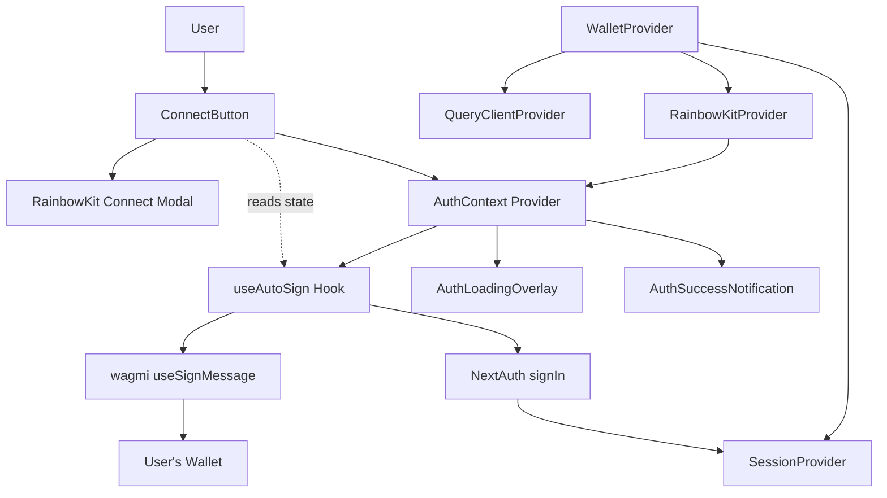
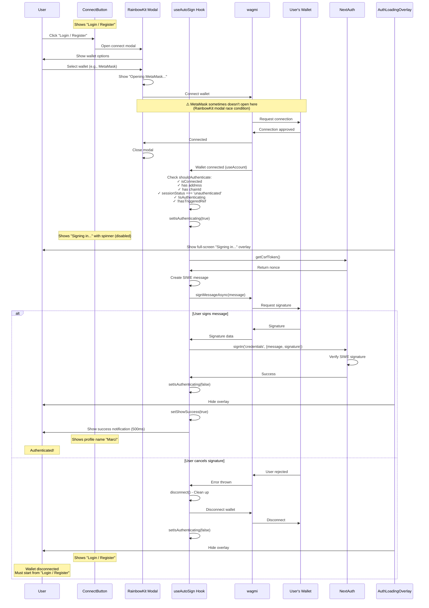
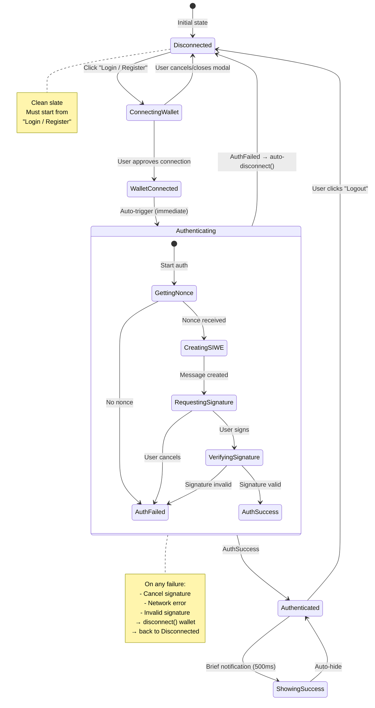

# Authentication Flow V2 - Clean Architecture

**Status**: Active implementation - refinement in progress

**Known Issues**:
- ⚠️ **MetaMask sometimes doesn't open when connecting wallet** (RainbowKit → MetaMask connection issue)
  - Happens at "Opening MetaMask..." step when user selects MetaMask in RainbowKit modal
  - NOT at signature request step (that works fine)
  - Root cause: RainbowKit internal issue with wallet connector initialization
  - **Not caused by our code** - happens BEFORE useAutoSign hook even triggers
  - Possible RainbowKit bug or browser extension race condition
  - User workaround: Close modal and try again, or use "Browser Wallet" option

**Recent Changes**:
- ✅ Removed dual authentication (RainbowKit provider + custom hook conflict)
- ✅ Auto-disconnect wallet on cancel/failure (no orphaned connections)
- ✅ Fixed page refresh auto-auth bug (detects new vs existing connections)
- ✅ Removed unnecessary 300ms delay (was in wrong location)
- ✅ Cleaned up wallet-auth.ts (removed 90 lines of commented code)
- ✅ Fixed isDev hardcoded value in connect-button
- ✅ Removed unused authenticationStatus checks (leftover from RainbowKit auth)
- ✅ Simplified and pruned authentication codebase
- ✅ Fixed button state during authentication (shows "Signing in..." while waiting)
- ✅ Created AuthContext to share authentication state across components

## Current Architecture (Option B: Hook-Only)



**Key Simplifications:**
- Single authentication path through `useAutoSign` hook only
- AuthContext shares authentication state with ConnectButton

## Clean Sequence Flow



## State Machine



## Component States

### useAutoSign Hook State

```typescript
interface AutoSignState {
  isAuthenticating: boolean;    // Currently requesting/verifying signature
  showSuccess: boolean;          // Brief success notification
  hasTriggeredRef: Ref<boolean>; // Prevents duplicate auth attempts
}
```

**State Transitions:**
- `hasTriggeredRef = true` on auth attempt start
- `hasTriggeredRef = false` only on wallet disconnect
- **NO RESET on error** (prevents infinite retry loop)

### Authentication Conditions

```typescript
const shouldAuthenticate =
  isConnected &&                           // Wallet connected via wagmi
  address &&                               // Valid wallet address
  chainId &&                               // Valid chain ID
  sessionStatus === 'unauthenticated' &&   // No active session
  !isAuthenticating &&                     // Not already authenticating
  !hasTriggeredRef.current;                // Haven't tried this session
```

## File Structure

```
src/
├── components/
│   ├── wallet-provider.tsx          # Main provider with useAutoSign + AuthContext
│   ├── connect-button.tsx           # "Login / Register" button (uses useAuthState)
│   ├── auth-loading-overlay.tsx     # Loading state during auth
│   └── auth-success-notification.tsx # Brief success message
├── hooks/
│   └── use-auto-sign.ts             # Core auth logic
└── lib/
    └── auth.ts                      # NextAuth config with SIWE
```

**AuthContext**: Shares `isAuthenticating` state from `useAutoSign` hook to `ConnectButton` and other components via `useAuthState()` hook.

## Core Logic: useAutoSign Hook

### Key Implementation Points

```typescript
// 1. Detect wallet connection + unauthenticated state
useEffect(() => {
  const shouldAuthenticate =
    isConnected && address && chainId &&
    sessionStatus === 'unauthenticated' &&
    !isAuthenticating && !hasTriggeredRef.current;

  if (!shouldAuthenticate) return;

  // 2. Set flag immediately to prevent duplicates
  hasTriggeredRef.current = true;
  setIsAuthenticating(true);

  // 3. Create SIWE message with nonce
  const nonce = await getCsrfToken();
  const message = new SiweMessage({...});

  // 4. Request signature
  const signature = await signMessageAsync({ message });

  // 5. Verify via NextAuth
  const result = await signIn('credentials', {
    message,
    signature,
    redirect: false,
  });

  if (result?.ok) {
    setShowSuccess(true);
    setTimeout(() => setShowSuccess(false), 500);
  }
}, [address, isConnected, chainId, sessionStatus, ...]);

// 6. Reset flag ONLY on disconnect (not on error!)
useEffect(() => {
  if (!isConnected) {
    hasTriggeredRef.current = false;
  }
}, [isConnected]);
```

### Error Handling

```typescript
} catch (error) {
  console.error('Auto-sign error:', error);
  // CRITICAL: Do NOT reset hasTriggeredRef here
  // User must disconnect and reconnect to retry
} finally {
  setIsAuthenticating(false);
}
```

**Why no retry on error:**
- Prevents infinite loops when user cancels
- User can explicitly retry by disconnecting wallet
- Better UX than aggressive auto-retry

## UI Components

### AuthLoadingOverlay

Shows when `isAuthenticating === true`:
- Full-screen overlay (z-index: 9999)
- Spinner animation
- "Signing in..." message
- "Please confirm in your wallet" subtext

### AuthSuccessNotification

Shows when `showSuccess === true`:
- Brief notification (500ms)
- Confirms successful authentication
- Auto-dismisses

### ConnectButton

Uses `useAuthState()` hook to access authentication state:

- **Disconnected:** "Login / Register" button
- **Connected + Authenticating:** "Signing in..." with spinner (disabled)
- **Connected + Authenticated:** Shows profile name and avatar (e.g., "Marci")
- **Connected + Wrong Network:** "Wrong network" (destructive button)
- **Fallback (connected but not authenticated):** "Login / Register" (rare edge case)

### ProfileModal

- Shows user profile (name, bio, wallet address)
- **Logout button** triggers:
  1. `signOut()` - Clear NextAuth session
  2. `disconnect()` - Disconnect wallet

## Authentication Flow Summary

1. ✅ User clicks "Login / Register"
2. ✅ RainbowKit modal opens with wallet options
3. ✅ User selects wallet and approves connection
4. ✅ RainbowKit modal closes
5. ✅ `useAutoSign` hook detects connection
6. ✅ Loading overlay shows "Signing in..."
7. ✅ Wallet opens with SIWE signature request
8. ✅ User signs message
9. ✅ NextAuth verifies signature
10. ✅ Session created
11. ✅ Success notification shows (500ms)
12. ✅ User is authenticated

**On Cancel:**
- Loading overlay disappears
- Wallet automatically disconnects
- Button reverts to "Login / Register"
- User must reconnect wallet to retry authentication

## Testing Checklist

- [ ] Click "Login / Register" → RainbowKit modal opens
- [ ] Select wallet → Connection request appears
- [ ] Approve connection → Modal closes, button shows "Signing in...", loading overlay appears
- [ ] Sign message → Success notification shows, button shows profile name
- [ ] Button correctly shows "Signing in..." while waiting (not profile name)
- [ ] Session persists on page refresh (no auto-signature on reload)
- [ ] Click "Logout" → Wallet disconnects, session clears, button shows "Login / Register"
- [ ] Cancel signature → No infinite retry loop, wallet disconnects, button shows "Login / Register"
- [ ] Disconnect & reconnect → Can retry authentication
- [ ] No duplicate signature requests
- [ ] No conflicting modals
