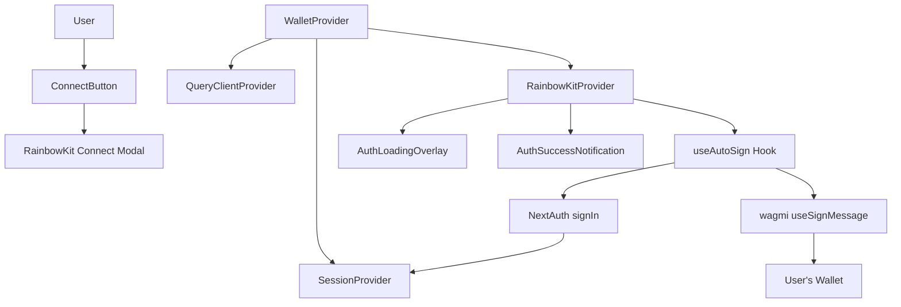

# Authentication Flow V2 - Clean Architecture

**Status**: Active implementation - refinement in progress

**Known Issues**:
- ⚠️ **MetaMask sometimes doesn't open when connecting wallet** (RainbowKit → MetaMask connection issue)
  - Happens at "Opening MetaMask..." step when user clicks "Login / Register"
  - NOT at signature request step
  - Root cause: RainbowKit modal race condition, not our code

**Recent Changes**:
- ✅ Removed dual authentication (RainbowKit provider + custom hook conflict)
- ✅ Auto-disconnect wallet on cancel/failure (no orphaned connections)
- ✅ Fixed page refresh auto-auth bug (detects new vs existing connections)
- ❌ Added 300ms delay before signature request (WRONG LOCATION - needs removal)
- 🔄 Need to simplify and prune code

## Current Architecture (Option B: Hook-Only)



**Key Simplification:** Single authentication path through `useAutoSign` hook only.

## Clean Sequence Flow

```mermaid
sequenceDiagram
    participant User
    participant Button as ConnectButton
    participant RKModal as RainbowKit Modal
    participant AutoSign as useAutoSign Hook
    participant Wagmi as wagmi
    participant Wallet as User's Wallet
    participant NextAuth
    participant Overlay as AuthLoadingOverlay

    User->>Button: Click "Login / Register"
    Button->>RKModal: Open connect modal
    RKModal->>User: Show wallet options

    User->>RKModal: Select wallet (e.g., MetaMask)
    RKModal->>RKModal: Show "Opening MetaMask..."
    RKModal->>Wagmi: Connect wallet

    Note over RKModal,Wallet: ⚠️ MetaMask sometimes doesn't open here<br/>(RainbowKit modal race condition)

    Wagmi->>Wallet: Request connection
    Wallet->>Wagmi: Connection approved
    Wagmi->>RKModal: Connected
    RKModal->>RKModal: Close modal

    Wagmi->>AutoSign: Wallet connected (useAccount)

    AutoSign->>AutoSign: Check shouldAuthenticate:<br/>✓ isConnected<br/>✓ has address<br/>✓ has chainId<br/>✓ sessionStatus === 'unauthenticated'<br/>✓ !isAuthenticating<br/>✓ !hasTriggeredRef

    AutoSign->>Overlay: setIsAuthenticating(true)
    Overlay->>User: Show "Signing in..." spinner

    AutoSign->>AutoSign: Wait 300ms (TODO: REMOVE - wrong location)

    AutoSign->>NextAuth: getCsrfToken()
    NextAuth->>AutoSign: Return nonce

    AutoSign->>AutoSign: Create SIWE message
    AutoSign->>Wagmi: signMessageAsync(message)
    Wagmi->>Wallet: Request signature

    alt User signs message
        Wallet->>Wagmi: Signature
        Wagmi->>AutoSign: Signature data
        AutoSign->>NextAuth: signIn('credentials', {message, signature})
        NextAuth->>NextAuth: Verify SIWE signature
        NextAuth->>AutoSign: Success
        AutoSign->>Overlay: setIsAuthenticating(false)
        Overlay->>User: Hide loading
        AutoSign->>AutoSign: setShowSuccess(true)
        AutoSign->>User: Show success notification (500ms)
        Note over User: Authenticated!
    else User cancels signature
        Wallet->>Wagmi: User rejected
        Wagmi->>AutoSign: Error thrown
        AutoSign->>AutoSign: disconnect() - Clean up
        AutoSign->>Wagmi: Disconnect wallet
        Wagmi->>Wallet: Disconnect
        AutoSign->>Overlay: setIsAuthenticating(false)
        Overlay->>User: Hide loading
        Note over User: Wallet disconnected<br/>Must start from "Login / Register"
    end
```



## State Machine

```mermaid
stateDiagram-v2
    [*] --> Disconnected: Initial state

    Disconnected --> ConnectingWallet: Click "Login / Register"
    ConnectingWallet --> WalletConnected: User approves connection
    ConnectingWallet --> Disconnected: User cancels/closes modal

    WalletConnected --> Authenticating: Auto-trigger (immediate)

    state Authenticating {
        [*] --> WaitingDelay: Start auth
        WaitingDelay --> GettingNonce: 300ms delay (TODO REMOVE)
        GettingNonce --> CreatingSIWE: Nonce received
        GettingNonce --> AuthFailed: No nonce
        CreatingSIWE --> RequestingSignature: Message created
        RequestingSignature --> VerifyingSignature: User signs
        RequestingSignature --> AuthFailed: User cancels
        VerifyingSignature --> AuthSuccess: Signature valid
        VerifyingSignature --> AuthFailed: Signature invalid
    }

    Authenticating --> Authenticated: AuthSuccess
    Authenticating --> Disconnected: AuthFailed → auto-disconnect()

    Authenticated --> ShowingSuccess: Brief notification (500ms)
    ShowingSuccess --> Authenticated: Auto-hide

    Authenticated --> Disconnected: User clicks "Logout"

    note right of Disconnected
        Clean slate
        Must start from
        "Login / Register"
    end note

    note right of Authenticating
        On any failure:
        - Cancel signature
        - Network error
        - Invalid signature
        → disconnect() wallet
        → back to Disconnected
    end note
```



## Component States

### useAutoSign Hook State

```typescript
interface AutoSignState {
  isAuthenticating: boolean;    // Currently requesting/verifying signature
  showSuccess: boolean;          // Brief success notification
  hasTriggeredRef: Ref<boolean>; // Prevents duplicate auth attempts
}
```

**State Transitions:**
- `hasTriggeredRef = true` on auth attempt start
- `hasTriggeredRef = false` only on wallet disconnect
- **NO RESET on error** (prevents infinite retry loop)

### Authentication Conditions

```typescript
const shouldAuthenticate =
  isConnected &&                           // Wallet connected via wagmi
  address &&                               // Valid wallet address
  chainId &&                               // Valid chain ID
  sessionStatus === 'unauthenticated' &&   // No active session
  !isAuthenticating &&                     // Not already authenticating
  !hasTriggeredRef.current;                // Haven't tried this session
```

## Key Differences from V1 (Buggy Version)

| Aspect | V1 (Buggy) | V2 (Clean) |
|--------|------------|------------|
| **Auth Systems** | Two competing systems:<br/>- RainbowKitAuthenticationProvider<br/>- useAutoSign hook | Single system:<br/>- useAutoSign hook only |
| **Modal Behavior** | RainbowKit showed "Verify account" modal<br/>+ Auto-sign triggered simultaneously | RainbowKit connect modal closes<br/>Hook takes over seamlessly |
| **Signature Requests** | Could create duplicate requests<br/>(modal + hook both trigger) | Single request from hook only |
| **Error Handling** | Reset `hasTriggeredRef` on error<br/>→ Infinite retry loop | Keep `hasTriggeredRef = true`<br/>→ User must reconnect |
| **State Sync** | Two systems with separate state | Single source of truth |
| **Complexity** | Custom adapter + provider + hook | Hook only |

## File Structure

```
src/
├── components/
│   ├── wallet-provider.tsx          # Main provider with useAutoSign
│   ├── connect-button.tsx           # "Login / Register" button
│   ├── auth-loading-overlay.tsx     # Loading state during auth
│   └── auth-success-notification.tsx # Brief success message
├── hooks/
│   └── use-auto-sign.ts             # Core auth logic
└── lib/
    └── auth.ts                      # NextAuth config with SIWE
```

## Core Logic: useAutoSign Hook

### Key Implementation Points

```typescript
// 1. Detect wallet connection + unauthenticated state
useEffect(() => {
  const shouldAuthenticate =
    isConnected && address && chainId &&
    sessionStatus === 'unauthenticated' &&
    !isAuthenticating && !hasTriggeredRef.current;

  if (!shouldAuthenticate) return;

  // 2. Set flag immediately to prevent duplicates
  hasTriggeredRef.current = true;
  setIsAuthenticating(true);

  // 3. Create SIWE message with nonce
  const nonce = await getCsrfToken();
  const message = new SiweMessage({...});

  // 4. Request signature
  const signature = await signMessageAsync({ message });

  // 5. Verify via NextAuth
  const result = await signIn('credentials', {
    message,
    signature,
    redirect: false,
  });

  if (result?.ok) {
    setShowSuccess(true);
    setTimeout(() => setShowSuccess(false), 500);
  }
}, [address, isConnected, chainId, sessionStatus, ...]);

// 6. Reset flag ONLY on disconnect (not on error!)
useEffect(() => {
  if (!isConnected) {
    hasTriggeredRef.current = false;
  }
}, [isConnected]);
```

### Error Handling

```typescript
} catch (error) {
  console.error('Auto-sign error:', error);
  // CRITICAL: Do NOT reset hasTriggeredRef here
  // User must disconnect and reconnect to retry
} finally {
  setIsAuthenticating(false);
}
```

**Why no retry on error:**
- Prevents infinite loops when user cancels
- User can explicitly retry by disconnecting wallet
- Better UX than aggressive auto-retry

## UI Components

### AuthLoadingOverlay

Shows when `isAuthenticating === true`:
- Full-screen overlay (z-index: 9999)
- Spinner animation
- "Signing in..." message
- "Please confirm in your wallet" subtext

### AuthSuccessNotification

Shows when `showSuccess === true`:
- Brief notification (500ms)
- Confirms successful authentication
- Auto-dismisses

### ConnectButton

- **Disconnected:** "Login / Register"
- **Connected + Authenticated:** Shows wallet info
- **Connected + Not Authenticated:** Shows address (rare, during auth)

### ProfileModal

- Shows user profile (name, bio, wallet address)
- **Logout button** triggers:
  1. `signOut()` - Clear NextAuth session
  2. `disconnect()` - Disconnect wallet

## Authentication Flow Summary

1. ✅ User clicks "Login / Register"
2. ✅ RainbowKit modal opens with wallet options
3. ✅ User selects wallet and approves connection
4. ✅ RainbowKit modal closes
5. ✅ `useAutoSign` hook detects connection
6. ✅ Loading overlay shows "Signing in..."
7. ✅ Wallet opens with SIWE signature request
8. ✅ User signs message
9. ✅ NextAuth verifies signature
10. ✅ Session created
11. ✅ Success notification shows (500ms)
12. ✅ User is authenticated

**On Cancel:**
- Loading overlay disappears
- User remains connected but not authenticated
- Must disconnect wallet to retry authentication

## Testing Checklist

- [ ] Click "Login / Register" → RainbowKit modal opens
- [ ] Select wallet → Connection request appears
- [ ] Approve connection → Modal closes, loading overlay appears
- [ ] Sign message → Success notification shows
- [ ] Session persists on page refresh
- [ ] Click "Logout" → Wallet disconnects and session clears
- [ ] Cancel signature → No infinite retry loop
- [ ] Disconnect & reconnect → Can retry authentication
- [ ] No duplicate signature requests
- [ ] No conflicting modals
