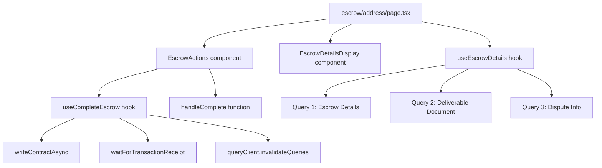
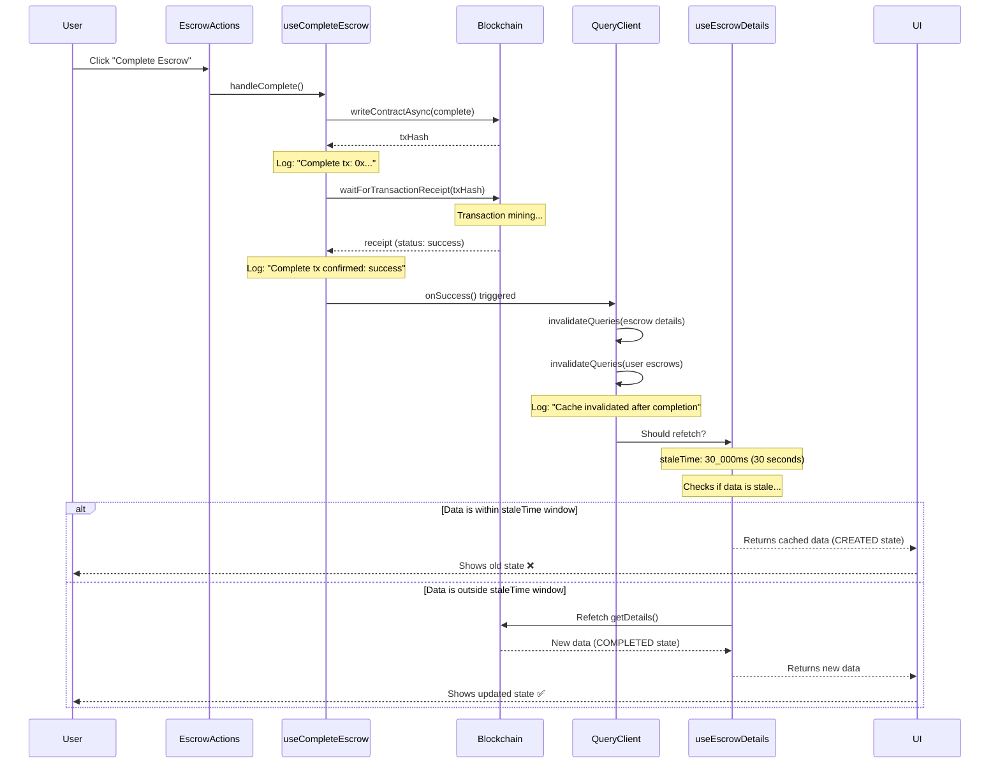
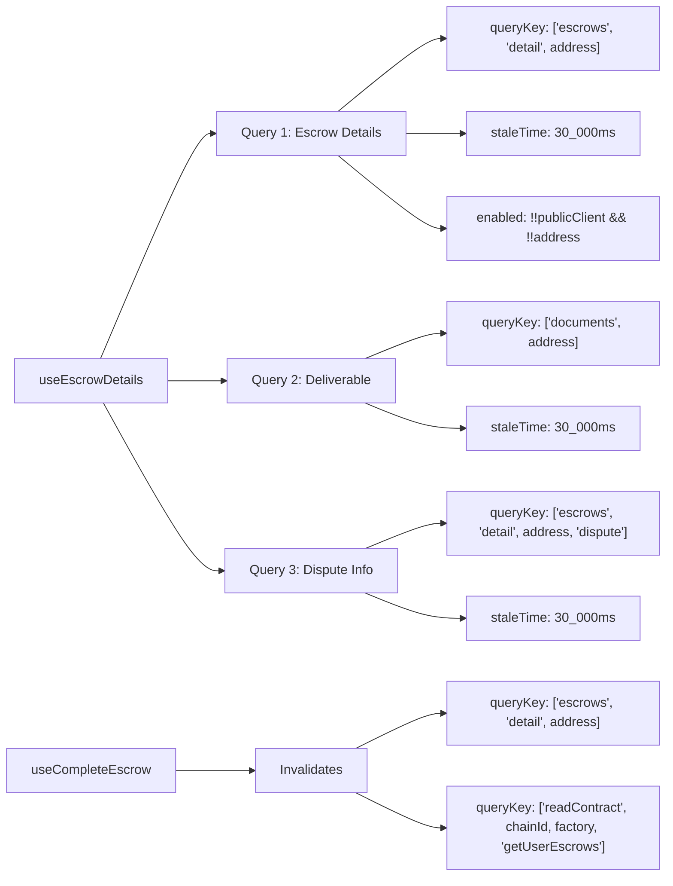
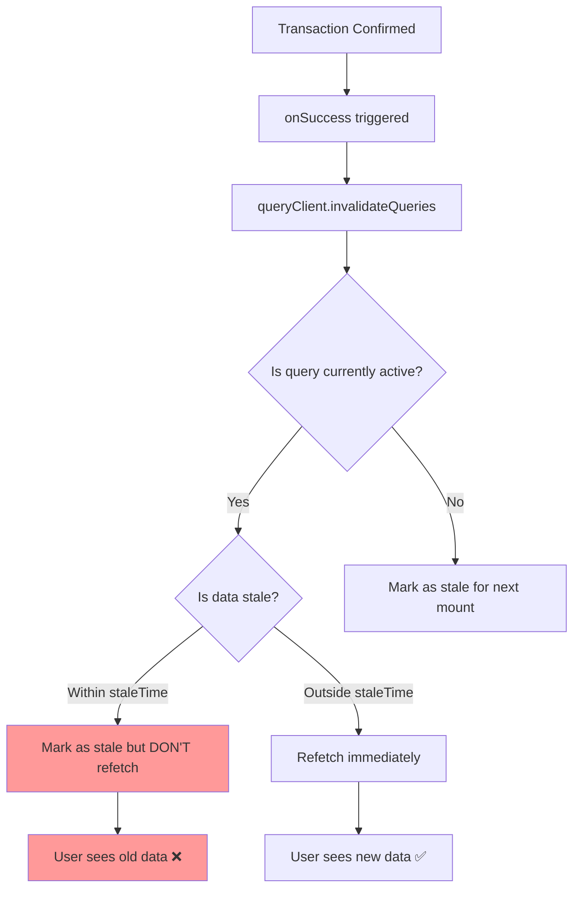

# Complete Button Flow Analysis

## Problem Statement
When a user clicks "Complete Escrow", the transaction succeeds but the UI does not update to show:
- State change from "Created" → "Completed"
- Removal of action buttons
- Success message display

## Current Architecture

### 1. Component Hierarchy



### 2. Complete Button Click Flow



### 3. Query Key Structure



### 4. The Problem: invalidateQueries vs Refetch



### 5. Timeline Analysis

```mermaid
gantt
    title Complete Button Click Timeline
    dateFormat X
    axisFormat %L ms

    section User Action
    ClickComplete       :done, 0, 100

    section Blockchain
    Send Transaction     :a2, 100, 500
    Mining              :a3, 500, 3000
    Confirmation        :milestone, after a3, 3000

    section Hook
    waitForReceipt      :a5, 500, 3000
    onSuccess           :a6, 3000, 3050

    section Cache
    invalidateQueries   :a7, 3050, 3100
    Check staleTime     :a8, 3100, 3150

    section Problem Window
    Query marked stale  :crit, a9, 3150, 3200
    BUT within staleTime :crit, a10, 3200, 30000
    No refetch happens  :crit, a11, 3200, 30000
```



## Root Cause Analysis

### Issue 1: invalidateQueries Behavior

From React Query docs:
- `invalidateQueries`: Marks queries as stale
- If query is **active** and **within staleTime**: Does NOT refetch
- Only refetches if **outside staleTime window**

**Timeline:**
1. User loads page at T=0s
2. Query fetches at T=0s (fresh until T=30s)
3. User clicks complete at T=5s
4. Transaction confirms at T=8s
5. `invalidateQueries` runs at T=8s
6. Query checks: "Am I stale?" → YES (marked by invalidate)
7. Query checks: "Am I within staleTime?" → YES (8s < 30s)
8. Query says: "I'll refetch on next mount or after staleTime"
9. **UI shows old data** ❌

### Issue 2: Query Key Matching

```javascript
// Hook invalidates:
queryClient.invalidateQueries({
  queryKey: queryKeys.escrows.detail(escrowAddress),
});

// Which expands to:
["escrows", "detail", "0xABC..."]

// But useEscrowDetails has 3 queries:
1. ["escrows", "detail", "0xABC..."] ✅ MATCHES
2. ["documents", "0xABC..."] ❌ NO MATCH
3. ["escrows", "detail", "0xABC...", "dispute"] ⚠️ PARTIAL MATCH
```

**Partial match behavior:**
- React Query uses **prefix matching**
- `["escrows", "detail", "0xABC..."]` invalidates:
  - `["escrows", "detail", "0xABC..."]` ✅
  - `["escrows", "detail", "0xABC...", "dispute"]` ✅
  - But NOT `["documents", "0xABC..."]` ❌

### Issue 3: useQueries Pattern

```javascript
const queries = useQueries({
  queries: [
    { queryKey: [...], queryFn: ..., staleTime: 30_000 },
    { queryKey: [...], queryFn: ..., staleTime: 30_000 },
    { queryKey: [...], queryFn: ..., staleTime: 30_000 },
  ]
});
```

**Problem:**
- Each query has **independent** staleness tracking
- Invalidating one doesn't automatically refetch others
- All 3 must be within their staleTime window

## Potential Solutions

### Option 1: Use refetchQueries instead

```javascript
// Force immediate refetch regardless of staleTime
queryClient.refetchQueries({
  queryKey: queryKeys.escrows.detail(escrowAddress),
});
```

**Pros:**
- Forces immediate data refresh
- Ignores staleTime

**Cons:**
- May cause duplicate fetches if multiple components use same query
- More aggressive than needed

### Option 2: Set staleTime: 0 for escrow details

```javascript
// In useEscrowDetails
staleTime: 0, // Always refetch when invalidated
```

**Pros:**
- Simple fix
- Works with invalidateQueries

**Cons:**
- Causes more frequent refetches
- May impact performance

### Option 3: Reduce staleTime window

```javascript
staleTime: 5_000, // 5 seconds instead of 30
```

**Pros:**
- More likely to be outside staleTime when invalidated
- Still has some caching benefit

**Cons:**
- Doesn't guarantee immediate update
- Still has race condition

### Option 4: Use refetch() on specific query instance

```javascript
// In component, after mutation
const { refetch } = useEscrowDetails(address);
await completeEscrowAsync(address);
refetch(); // Force this specific instance to refetch
```

**Pros:**
- Precise control
- No cache conflicts

**Cons:**
- Requires passing refetch callback
- Breaks separation of concerns (hook should handle this)

### Option 5: Optimistic Updates

```javascript
onMutate: async (escrowAddress) => {
  // Cancel outgoing refetches
  await queryClient.cancelQueries({ queryKey: queryKeys.escrows.detail(escrowAddress) });

  // Snapshot previous value
  const previousData = queryClient.getQueryData(queryKeys.escrows.detail(escrowAddress));

  // Optimistically update to COMPLETED state
  queryClient.setQueryData(queryKeys.escrows.detail(escrowAddress), (old) => ({
    ...old,
    state: EscrowState.COMPLETED,
  }));

  return { previousData };
},
onError: (err, variables, context) => {
  // Rollback on error
  queryClient.setQueryData(
    queryKeys.escrows.detail(variables),
    context.previousData
  );
},
onSettled: () => {
  // Refetch to sync with server
  queryClient.invalidateQueries(...);
}
```

**Pros:**
- Instant UI update
- Best UX

**Cons:**
- Complex implementation
- Requires careful error handling
- Must handle all state changes (details, deliverable, dispute)

## Recommended Solution

**Hybrid Approach: refetchQueries + Selective Invalidation**

```javascript
onSuccess: (_data, escrowAddress) => {
  // Force immediate refetch of escrow details (state changed)
  queryClient.refetchQueries({
    queryKey: queryKeys.escrows.detail(escrowAddress),
    type: 'active', // Only refetch if query is currently mounted
  });

  // Invalidate user escrows list (will refetch on next mount or when stale)
  queryClient.invalidateQueries({
    queryKey: ["readContract", publicClient?.chain?.id, MASTER_FACTORY_ADDRESS, "getUserEscrows"],
  });
}
```

**Why this works:**
1. `refetchQueries` with `type: 'active'` → Only refetches mounted queries (avoids unnecessary fetches)
2. Ignores staleTime → Forces immediate update
3. Dashboard uses `invalidateQueries` → Will refetch when user navigates back
4. Minimal performance impact

## Testing Checklist

- [ ] Click Complete on fresh page load (< 30s)
- [ ] Click Complete on stale page (> 30s)
- [ ] Click Complete, immediately navigate to dashboard
- [ ] Click Complete, wait 5s, check UI
- [ ] Create escrow, immediately complete (< 1s)
- [ ] Multiple rapid completions
- [ ] Complete with slow network
- [ ] Complete while offline → online

