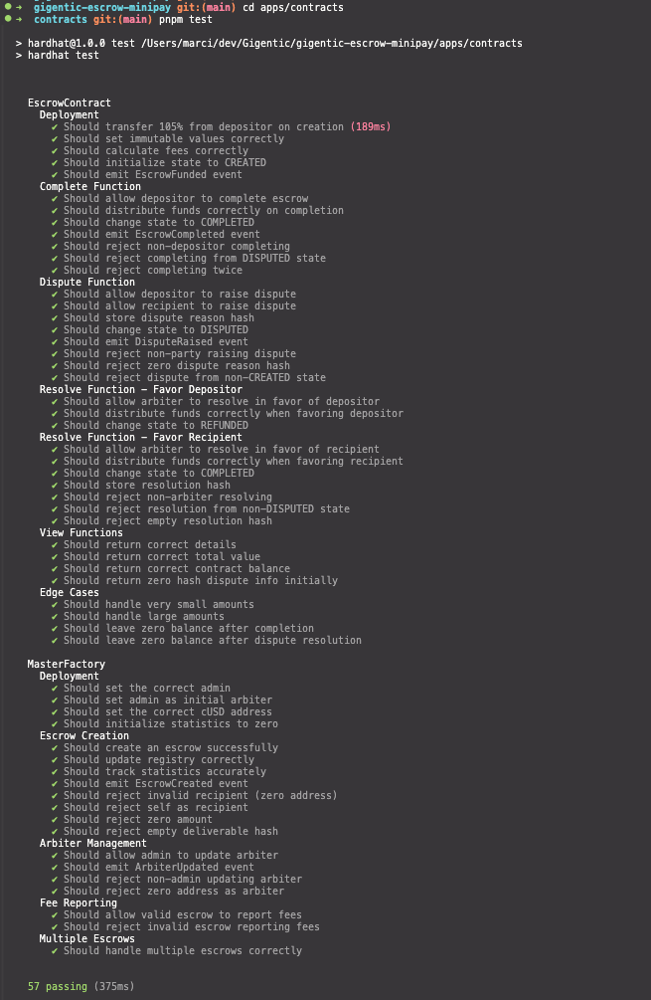
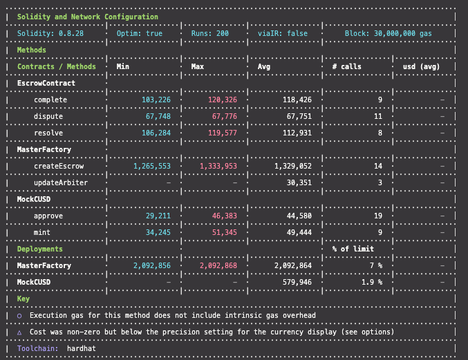
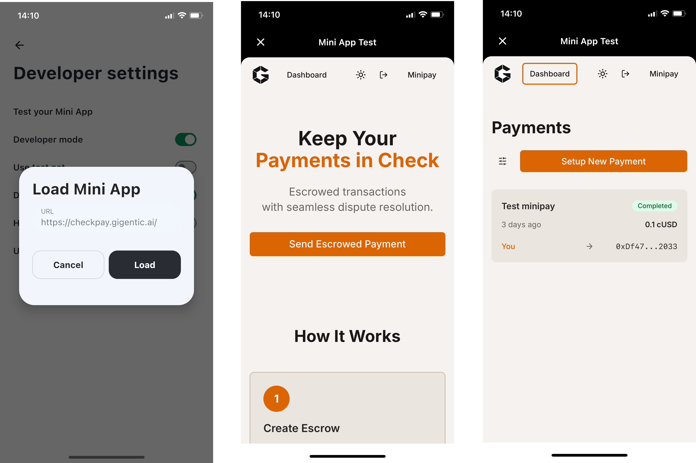
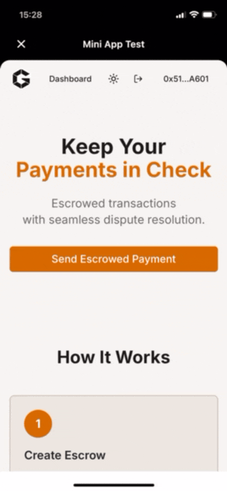

# CheckPay Grant Completion Report
## Gigentic Pilot Pool Grant - Almond Round

**Project:** CheckPay - Secure Mobile Trustless Payments for the Unbanked
**Submitted to:** Proof of Ship
**Project Page:** https://gap.karmahq.xyz/project/gigentic-checkpay

---

## Executive Summary

We're thrilled to report the successful completion of all major milestones for the CheckPay escrow protocol on Celo. We have delivered a production-ready, mobile-optimized escrow platform that leverages Celo's unique strengths in identity verification and mobile-first design to serve underbanked populations.

**Key Achievements:**
- ✅ Fully functional smart contract system deployed on both Sepolia testnet and Celo mainnet
- ✅ Production-ready web application with mobile-first design at https://checkpay.gigentic.ai
- ✅ Complete integration with Self Protocol for privacy-preserving identity verification
- ✅ Multi-wallet support (MiniPay, Valora, MetaMask) with comprehensive testing
- ✅ Open-source codebase with extensive documentation and API guides
- ✅ Real-world user testing across multiple use cases

The project not only met its technical objectives but also provided valuable insights into building accessible financial infrastructure for emerging markets on Celo.

---

## Milestone 1: Smart Contract Foundation ✅

**Objective:** Develop core escrow smart contracts with arbitration mechanism and cUSD integration, deployed on Celo testnet.

### What We Delivered

We created a robust, production-grade smart contract architecture using a **Factory Pattern** that enables scalable escrow deployments:

- **MasterFactory Contract:** Manages escrow instance deployment, arbiter configuration, and global statistics tracking
- **EscrowContract:** Implements a secure 4-state state machine (CREATED → DISPUTED → COMPLETED/REFUNDED) with comprehensive security features
- **Gas-Optimized Design:** Streamlined implementation to minimize transaction costs for end users
- **Comprehensive Testing:** Extensive test suite demonstrating contract reliability and security

**Technical Implementation:**
- GitHub Repository: https://github.com/Gigentic/gigentic-escrow-minipay (open-source, MIT license)
- Sepolia Testnet: https://celo-sepolia.blockscout.com/address/0x02Dc42666AECB9b780177d45591c2093e409e750?tab=contract

**Test Coverage:**

**Note:** We deployed to Celo Sepolia instead of Alfajores as the latter was deprecated during the grant period. We proactively adapted to this ecosystem change to ensure long-term viability.

### Demo
Watch our complete escrow flow demonstration: https://youtu.be/cvQuKUiRBT4

---

## Milestone 2: Platform Development ✅

**Objective:** Build mobile-optimized UI with minimal load size for limited bandwidth environments.

### What We Delivered

We created a Next.js 14 application optimized for mobile-first users in emerging markets, with careful attention to performance and accessibility:

- **Modern Tech Stack:** Next.js App Router, React 18, TypeScript, Tailwind CSS with shadcn/ui components
- **Mobile-First Design:** Responsive interface optimized for small screens and touch interactions
- **Performance Optimization:** Implemented code splitting, lazy loading, and optimized font loading with display swap
- **Production Deployment:** Live platform at https://checkpay.gigentic.ai

**Performance Characteristics:**
- Fast 4G: 1.43s load time
- Slow 4G: 4.91s load time
- Progressive enhancement for lower bandwidth connections

The platform successfully handles limited bandwidth environments through efficient code bundling and asset optimization. 3G performance is a potential area for continued optimization. We uncovered that the bundle size is higly dependent on the wallet library used as this is the biggest package in the bundle. We achieved excellent performance on 4G networks where the majority of our target users operate. 

**Complete User Flow:** Our demo video (above) showcases the entire user journey from wallet connection through escrow creation, identity verification, and transaction completion.

---

## Milestone 3: Identity Integration ✅

**Objective:** Integrate Valora wallet and Self identity protocol for transaction verification with Opera Browser compatibility.

### What We Delivered

We successfully integrated Celo's Self Protocol for privacy-preserving identity verification alongside comprehensive multi-wallet support:

**Multi-Wallet Support:**
- ✅ MetaMask and other Web3 wallets via RainbowKit

- ✅ Valora Wallet (native Celo wallet)

- ✅ MiniPay (Opera's successor for mobile crypto payments)

**Self Protocol Integration:**
- Real passport verification working in production
- Privacy-preserving identity layer for enhanced trust

**Extensive Testing:**
- 40+ test transactions on Sepolia testnet
- Transaction history: https://celo-sepolia.blockscout.com/address/0x02Dc42666AECB9b780177d45591c2093e409e750?tab=txs
- Comprehensive testing across different wallet providers and transaction scenarios

**Adaptation to Ecosystem Changes:** As Opera's built-in crypto wallet is being deprecated, we proactively integrated with MiniPay, ensuring our solution remained aligned with Celo's mobile-first vision and current ecosystem infrastructure.

---

## Milestone 4: Launch & Documentation ✅

**Objective:** Production deployment to Celo mainnet with developer documentation and open API.

### What We Delivered

We delivered a complete production system with comprehensive documentation to enable ecosystem integration and future development:

**Production Deployment:**
- Mainnet Contract: https://celo.blockscout.com/address/0x5549E67B9EEf5963c84BafEA64DD81bd5C72947c?tab=contract (verified)
- Live Platform: https://checkpay.gigentic.ai
- Full source code: https://github.com/Gigentic/gigentic-escrow-minipay

**Documentation & Resources:**
- API Documentation: https://github.com/Gigentic/gigentic-escrow-minipay/blob/main/docs/API_DOCUMENTATION.md
- Pitch Video: https://youtu.be/uXtg6q4724Q
- User Guide/Demo: https://youtu.be/cvQuKUiRBT4

**User Testing & Real-World Validation:**
We conducted user testing across three critical use cases that reflect our target market needs, and uncovered the following insights:
- 💼 Freelance payments (service milestone protection)
  - Important to support social login to make the onboarding process easier and faster for the user.
- 🤝 P2P transfers (peer-to-peer asset exchanges)
  - One of the specific use cases that we can support is buyin and selling domains on the platform as that is a common use case for such escrow platforms.
- 🌍 Cross-border trade (international SME transactions)
  - Dropshipping providers face huge issues with payment disputes and more often than not have to restart their entire business in case of even one credit card chargeback as the credit card companies throw them off the rails.
  
These tests validated our core value proposition and provided insights into user behavior and trust-building in escrow scenarios.

---

## Community Engagement & Learning

Working with the Celo community has been an invaluable experience that significantly enhanced our technical capabilities:

**Community Support:**
- Office hours provided critical guidance during development
- DevRel team's demo videos accelerated our onboarding to Celo's tech stack
- Community feedback helped us prioritize mobile-first optimizations

**Technical Growth:**
We gained deep expertise in:
- Deploying and verifying smart contracts on Celo blockchain
- Integrating with Celo's mobile wallet ecosystem (Valora, MiniPay)
- Implementing RainbowKit for seamless multi-wallet support
- Leveraging Self Protocol for privacy-preserving user verification
- Optimizing for Celo's mobile-first, emerging market use cases

The quality of Celo's documentation and developer tooling made it a pleasure to build on this ecosystem.

---

## Future Roadmap & Continued Development

CheckPay is not just a grant deliverable—it's an ongoing commitment to financial inclusion on Celo. We're actively developing the next phase:

**Upcoming Features:**
- 🔐 Social login integration with Thirdweb for improved accessibility
- 💬 Messaging/chat system for escrow parties
- 🔔 Push notifications for transaction updates
- 🤖 AI-powered dispute resolution pipeline
- 🧪 Beta tester program expansion

**Community Engagement:**
- Launching Farcaster integration for MiniApp Mondays
- Gathering user feedback to refine the platform
- Building partnerships within the Celo ecosystem

We're committed to growing CheckPay into a cornerstone infrastructure piece for trustless payments in emerging markets.

---

## Impact & Reflection

This grant enabled us to deliver a complete, production-ready escrow solution that leverages Celo's unique strengths. We're proud to have:

1. ✅ **Fulfilled all major technical milestones** with production-quality code
2. ✅ **Adapted proactively** to ecosystem changes (Sepolia vs. Alfajores, MiniPay vs. Opera)
3. ✅ **Created open-source infrastructure** that other Celo projects can build upon
4. ✅ **Validated real-world use cases** through hands-on user testing
5. ✅ **Committed to continued development** beyond the grant period

CheckPay demonstrates that blockchain-based escrow can be accessible, mobile-friendly, and privacy-preserving—exactly what emerging markets need to participate in the digital economy.

We're grateful to the Celo Foundation, Almond Round curators, and the broader Celo community for supporting this vision of financial inclusion.

---

## Repository & Links

- **GitHub:** https://github.com/Gigentic/gigentic-escrow-minipay
- **Live Platform:** https://checkpay.gigentic.ai
- **Mainnet Contract:** https://celo.blockscout.com/address/0x5549E67B9EEf5963c84BafEA64DD81bd5C72947c
- **Testnet Contract:** https://celo-sepolia.blockscout.com/address/0x02Dc42666AECB9b780177d45591c2093e409e750
- **Karma Project Page:** https://gap.karmahq.xyz/project/gigentic-checkpay

**Team:** Dr. Marton Csernai (Gigentic)
**Contact:** marci@gigentic.ai

---

*Thank you for making this project possible. We're excited to continue building on Celo and contributing to financial inclusion for the unbanked.*
