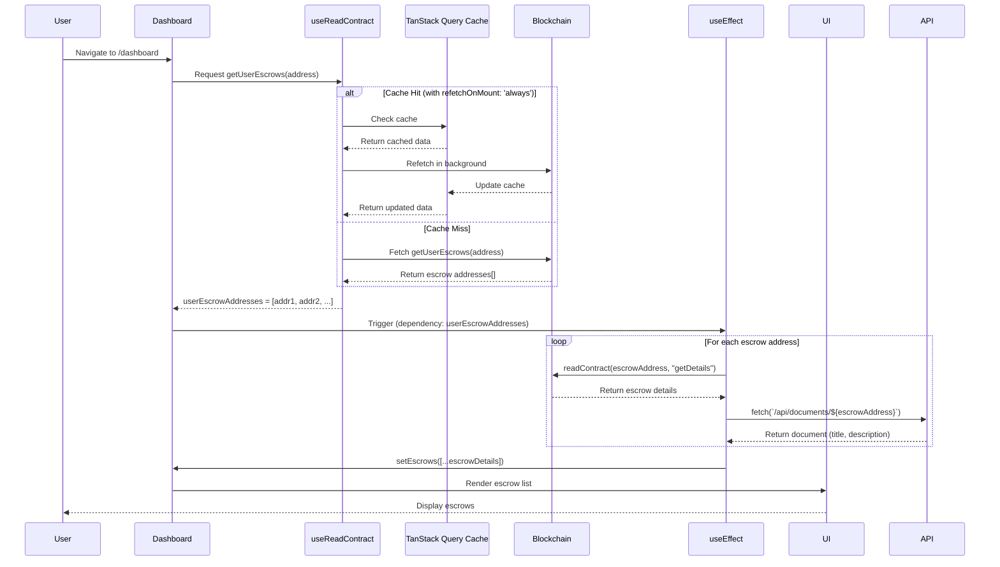

# Escrow Fetch Flow Analysis

## Current Implementation

The dashboard fetches escrow data in a two-step process:

1. **Step 1**: Fetch user's escrow addresses from MasterFactory contract
2. **Step 2**: Fetch individual escrow details for each address

## Flow Diagram



## Current Issue

### Problem
When creating a new escrow and redirecting to dashboard:
- The new escrow exists on the blockchain
- But it doesn't appear in the dashboard list

### Why It Happens

**Root Cause**: Reference equality check in `useEffect` dependency array

```typescript
// dashboard/page.tsx:38-89
useEffect(() => {
  const fetchEscrowDetails = async () => {
    // Fetch details for each escrow...
  };
  fetchEscrowDetails();
}, [userEscrowAddresses, publicClient]); // ← Dependency array
```

The flow:
1. User creates escrow → blockchain updated
2. Redirect to `/dashboard`
3. `useReadContract` with `refetchOnMount: 'always'` fetches new addresses
4. **TanStack Query** returns the **same array reference** if the data hasn't changed structurally
5. `useEffect` doesn't re-run because `userEscrowAddresses` reference is the same
6. UI shows stale data

### Why `refetchOnMount: 'always'` Didn't Work

From wagmi docs:
> "If set to `'always'`, the query will always refetch on mount."

However:
- `refetchOnMount: 'always'` **does** trigger a blockchain refetch
- The blockchain **does** return updated data
- BUT: TanStack Query's cache uses **reference equality**
- If the returned array is structurally identical (same addresses, same order), React doesn't detect a change
- The `useEffect` dependency `userEscrowAddresses` doesn't trigger a re-run

## Attempted Fix

```typescript
// Added to dashboard/page.tsx:34
query: {
  enabled: !!address,
  refetchOnMount: 'always', // ← This DOES refetch, but doesn't help
},
```

This ensures data is fetched from blockchain, but doesn't solve the dependency issue.

## Solution Options

### Option 1: Use `refetch` function manually
```typescript
useEffect(() => {
  refetch(); // Force refetch on mount
}, []);
```

### Option 2: Add `staleTime: 0` explicitly
```typescript
query: {
  enabled: !!address,
  refetchOnMount: 'always',
  staleTime: 0, // Explicitly mark as stale immediately
},
```

### Option 3: Force useEffect re-run with router state
```typescript
const searchParams = useSearchParams();
const forceRefresh = searchParams.get('refresh');

useEffect(() => {
  fetchEscrowDetails();
}, [userEscrowAddresses, publicClient, forceRefresh]);
```

Then redirect with: `router.push('/dashboard?refresh=' + Date.now())`

### Option 4: Use a refresh trigger state
```typescript
const [refreshTrigger, setRefreshTrigger] = useState(0);

useEffect(() => {
  setRefreshTrigger(Date.now());
}, [address]); // Trigger on address change

useEffect(() => {
  fetchEscrowDetails();
}, [userEscrowAddresses, publicClient, refreshTrigger]);
```

## Recommended Solution

**Option 1 + refetchOnMount** is the simplest and most reliable:

```typescript
// Force fresh data on every mount
useEffect(() => {
  refetch();
}, [refetch]);

useEffect(() => {
  fetchEscrowDetails();
}, [userEscrowAddresses, publicClient]);
```

This ensures:
1. Fresh blockchain data on every dashboard visit
2. `useEffect` re-runs when data changes
3. Minimal code changes
4. No URL manipulation or extra state

## Applied Fixes

### 1. Dashboard Page (apps/web/src/app/dashboard/page.tsx:37-42)

```typescript
// Force refetch on mount to get latest data
useEffect(() => {
  if (address) {
    refetch();
  }
}, [address, refetch]);
```

**Result**: New escrows appear immediately after creation and redirect to dashboard.

### 2. Admin Disputes Page (apps/web/src/app/admin/disputes/page.tsx:26-31, 61)

```typescript
const [mountTrigger, setMountTrigger] = useState(0);

// Force refetch on mount
useEffect(() => {
  setMountTrigger(Date.now());
}, []);

// Add mountTrigger to dependency array
useEffect(() => {
  const fetchDisputes = async () => {
    // ... fetch logic
  };
  fetchDisputes();
}, [status, mountTrigger]);
```

**Result**: Resolved disputes are removed from the list when admin returns to the disputes page.

### 3. Escrow Detail Page (apps/web/src/app/escrow/[address]/page.tsx:27-32, 130)

```typescript
const [mountTrigger, setMountTrigger] = useState(0);

// Force refetch on mount
useEffect(() => {
  setMountTrigger(Date.now());
}, []);

// Add mountTrigger to dependency array
useEffect(() => {
  fetchEscrowData();
}, [escrowAddress, publicClient, mountTrigger]);
```

**Result**: Escrow state updates (resolved, completed, etc.) are reflected when navigating to the page.

**Note**: This page also has `onSuccess={fetchEscrowData}` callback in EscrowActions component, which handles refreshes after user actions on the same page.

## Summary

All three pages now force a data refetch on mount, ensuring:
- ✅ New escrows appear in dashboard after creation
- ✅ Resolved disputes disappear from admin disputes list
- ✅ Escrow detail pages show current state after resolution
- ✅ Minimal code changes (3-5 lines per file)
- ✅ No complex state management or URL manipulation
- ✅ Consistent pattern across all pages
