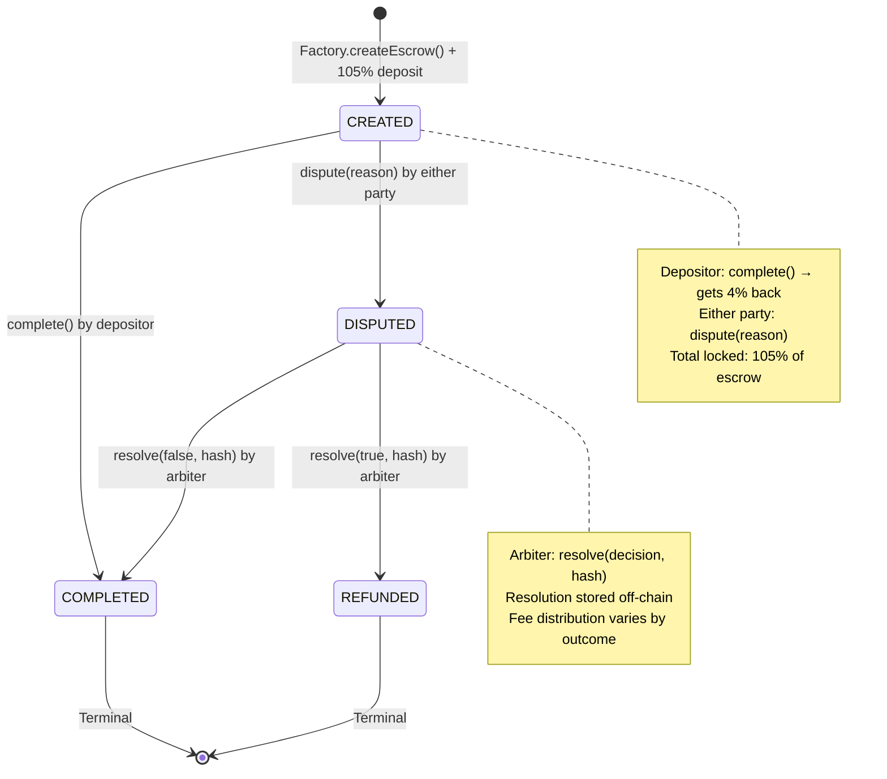

# Gigentic Escrow v1.6: Smart Contract Specification
## Factory-Based Escrow with Hash-Based Deliverables

### 🎯 Contract Overview

A factory-based escrow system with dispute resolution using cUSD (Celo Dollar) as the currency. The system uses hash-based deliverable tracking with off-chain storage for gas efficiency.

**Core Features:**
- Factory pattern for escrow creation
- 1% platform fee + 4% dispute bond
- Hash-based deliverable and resolution tracking
- Admin-controlled arbiter designation
- cUSD token integration
- ERC-20 token handling with security features

---

## 🏗️ Contract Architecture

### Contract Structure

```
MasterFactory.sol
├── Creates EscrowContract instances
├── Maintains registry of all escrows
├── Configures arbiter address
└── Tracks global statistics

EscrowContract.sol
├── Holds funds for single escrow
├── Implements 4-state machine
├── Records deliverable and resolution hashes
└── Handles fee distribution
```

### State Management

```solidity
enum EscrowState {
    CREATED,      // 0: Funds locked, awaiting completion or dispute
    DISPUTED,     // 1: Dispute raised, arbiter can resolve
    COMPLETED,    // 2: Funds released to recipient
    REFUNDED      // 3: Funds returned to depositor
}

struct EscrowData {
    address depositor;
    address recipient;
    uint256 escrowAmount;      // The actual escrow (100%)
    uint256 platformFee;        // 1% fee
    uint256 disputeBond;        // 4% bond
    uint256 createdAt;
    EscrowState state;
    bytes32 deliverableHash;   // Hash of deliverable document
    string disputeReason;       // On-chain dispute reason
    bytes32 resolutionHash;     // Hash of resolution document
}
```

---

## 📜 Smart Contract Implementation

### MasterFactory Contract

```solidity
// SPDX-License-Identifier: MIT
pragma solidity ^0.8.19;

import "./EscrowContract.sol";

contract MasterFactory {
    address public admin;
    address public arbiter;
    address public immutable cUSDAddress;
    
    // Registry
    address[] public allEscrows;
    mapping(address => address[]) public userEscrows; // user -> their escrows
    mapping(address => bool) public isValidEscrow;
    
    // Statistics
    uint256 public totalEscrowsCreated;
    uint256 public totalVolumeProcessed;
    uint256 public totalFeesCollected;
    
    // Events
    event EscrowCreated(
        address indexed escrowAddress,
        address indexed depositor,
        address indexed recipient,
        uint256 amount,
        bytes32 deliverableHash
    );
    event ArbiterUpdated(address oldArbiter, address newArbiter);
    
    modifier onlyAdmin() {
        require(msg.sender == admin, "Only admin");
        _;
    }
    
    // Mainnet: 0x765DE816845861e75A25fCA122bb6898B8B1282a
    // Testnet: 0x874069Fa1Eb16D44d622F2e0Ca25eeA172369bC1
    constructor(address _cUSDAddress) {
        admin = msg.sender;
        arbiter = msg.sender; // Admin is initial arbiter
        cUSDAddress = _cUSDAddress;
    }
    
    function createEscrow(
        address _recipient,
        uint256 _amount,
        bytes32 _deliverableHash
    ) external returns (address) {
        require(_recipient != address(0) && _recipient != msg.sender, "Invalid recipient");
        require(_amount > 0, "Amount must be greater than 0");
        require(_deliverableHash != bytes32(0), "Deliverable hash required");
        
        // Deploy new escrow contract
        EscrowContract escrow = new EscrowContract(
            msg.sender,        // depositor
            _recipient,
            _amount,
            _deliverableHash,
            arbiter,
            cUSDAddress
        );
        
        address escrowAddress = address(escrow);
        
        // Update registry
        allEscrows.push(escrowAddress);
        userEscrows[msg.sender].push(escrowAddress);
        userEscrows[_recipient].push(escrowAddress);
        isValidEscrow[escrowAddress] = true;
        
        // Update statistics
        totalEscrowsCreated++;
        totalVolumeProcessed += _amount;
        
        emit EscrowCreated(
            escrowAddress,
            msg.sender,
            _recipient,
            _amount,
            _deliverableHash
        );
        
        return escrowAddress;
    }
    
    function updateArbiter(address _newArbiter) external onlyAdmin {
        require(_newArbiter != address(0), "Invalid arbiter");
        address oldArbiter = arbiter;
        arbiter = _newArbiter;
        emit ArbiterUpdated(oldArbiter, _newArbiter);
    }
    
    // View functions
    function getUserEscrows(address user) external view returns (address[] memory) {
        return userEscrows[user];
    }
    
    function getAllEscrows() external view returns (address[] memory) {
        return allEscrows;
    }
    
    function getStatistics() external view returns (
        uint256 escrowsCreated,
        uint256 volumeProcessed,
        uint256 feesCollected
    ) {
        return (totalEscrowsCreated, totalVolumeProcessed, totalFeesCollected);
    }
    
    // Callback from escrow contracts to update fee statistics
    function reportFeeCollection(uint256 feeAmount) external {
        require(isValidEscrow[msg.sender], "Only valid escrows");
        totalFeesCollected += feeAmount;
    }
}
```

### EscrowContract

```solidity
// SPDX-License-Identifier: MIT
pragma solidity ^0.8.19;

import "@openzeppelin/contracts/token/ERC20/IERC20.sol";
import "@openzeppelin/contracts/token/ERC20/utils/SafeERC20.sol";
import "@openzeppelin/contracts/security/ReentrancyGuard.sol";

interface IFactory {
    function reportFeeCollection(uint256 feeAmount) external;
}

contract EscrowContract is ReentrancyGuard {
    using SafeERC20 for IERC20;
    
    // Constants
    uint256 public constant PLATFORM_FEE_BPS = 100;  // 1%
    uint256 public constant DISPUTE_BOND_BPS = 400;  // 4%
    uint256 private constant BPS_DENOMINATOR = 10000;
    
    // State
    enum EscrowState { CREATED, DISPUTED, COMPLETED, REFUNDED }
    
    // Core data
    address public immutable factory;
    address public immutable depositor;
    address public immutable recipient;
    address public immutable arbiter;
    IERC20 public immutable token;
    
    uint256 public immutable escrowAmount;    // The actual escrow (100%)
    uint256 public immutable platformFee;     // 1% of escrowAmount
    uint256 public immutable disputeBond;     // 4% of escrowAmount
    uint256 public immutable totalDeposited;  // 105% total
    uint256 public immutable createdAt;
    
    bytes32 public immutable deliverableHash;
    
    // Mutable state
    EscrowState public state;
    string public disputeReason;
    bytes32 public resolutionHash;
    
    // Events
    event EscrowFunded(uint256 amount, uint256 fee, uint256 bond);
    event EscrowCompleted(address indexed recipient, uint256 amount);
    event EscrowRefunded(address indexed depositor, uint256 amount);
    event DisputeRaised(address indexed raiser, string reason);
    event DisputeResolved(
        bool favorDepositor, 
        bytes32 resolutionHash, 
        uint256 payoutAmount,
        uint256 feeAmount
    );
    
    modifier onlyDepositor() {
        require(msg.sender == depositor, "Only depositor");
        _;
    }
    
    modifier onlyArbiter() {
        require(msg.sender == arbiter, "Only arbiter");
        _;
    }
    
    modifier onlyParties() {
        require(
            msg.sender == depositor || msg.sender == recipient,
            "Only parties"
        );
        _;
    }
    
    modifier inState(EscrowState _state) {
        require(state == _state, "Invalid state");
        _;
    }
    
    constructor(
        address _depositor,
        address _recipient,
        uint256 _amount,
        bytes32 _deliverableHash,
        address _arbiter,
        address _tokenAddress
    ) {
        require(_depositor != address(0), "Invalid depositor");
        require(_recipient != address(0), "Invalid recipient");
        require(_amount > 0, "Amount must be greater than 0");
        require(_deliverableHash != bytes32(0), "Deliverable hash required");
        require(_arbiter != address(0), "Invalid arbiter");
        require(_tokenAddress != address(0), "Invalid token address");
        
        factory = msg.sender;
        depositor = _depositor;
        recipient = _recipient;
        arbiter = _arbiter;
        token = IERC20(_tokenAddress);
        
        escrowAmount = _amount;
        platformFee = (_amount * PLATFORM_FEE_BPS) / BPS_DENOMINATOR;
        disputeBond = (_amount * DISPUTE_BOND_BPS) / BPS_DENOMINATOR;
        totalDeposited = _amount + platformFee + disputeBond;
        
        deliverableHash = _deliverableHash;
        createdAt = block.timestamp;
        state = EscrowState.CREATED;
        
        // Transfer funds from depositor to contract
        token.safeTransferFrom(_depositor, address(this), totalDeposited);
        
        emit EscrowFunded(escrowAmount, platformFee, disputeBond);
    }
    
    // Core Functions
    
    function complete() external onlyDepositor inState(EscrowState.CREATED) nonReentrant {
        state = EscrowState.COMPLETED;
        
        // Transfer escrow amount to recipient
        token.safeTransfer(recipient, escrowAmount);
        
        // Transfer platform fee to arbiter
        token.safeTransfer(arbiter, platformFee);
        
        // Return dispute bond to depositor
        token.safeTransfer(depositor, disputeBond);
        
        // Report fee collection to factory
        IFactory(factory).reportFeeCollection(platformFee);
        
        emit EscrowCompleted(recipient, escrowAmount);
    }
    
    function dispute(string memory reason) external onlyParties inState(EscrowState.CREATED) {
        require(bytes(reason).length > 0 && bytes(reason).length <= 256, "Invalid dispute reason");
        
        state = EscrowState.DISPUTED;
        disputeReason = reason;
        
        emit DisputeRaised(msg.sender, reason);
    }
    
    function resolve(
        bool favorDepositor,
        bytes32 _resolutionHash
    ) external onlyArbiter inState(EscrowState.DISPUTED) nonReentrant {
        require(_resolutionHash != bytes32(0), "Resolution hash required");
        
        resolutionHash = _resolutionHash;
        
        if (favorDepositor) {
            state = EscrowState.REFUNDED;
            
            // Refund escrow amount to depositor
            token.safeTransfer(depositor, escrowAmount);
            
            // Depositor also gets their dispute bond back
            token.safeTransfer(depositor, disputeBond);
            
            // Arbiter gets platform fee only
            token.safeTransfer(arbiter, platformFee);
            
            IFactory(factory).reportFeeCollection(platformFee);
            
            emit DisputeResolved(true, _resolutionHash, escrowAmount + disputeBond, platformFee);
            emit EscrowRefunded(depositor, escrowAmount);
            
        } else {
            state = EscrowState.COMPLETED;
            
            // Transfer escrow amount to recipient
            token.safeTransfer(recipient, escrowAmount);
            
            // Arbiter gets platform fee + dispute bond
            uint256 totalArbitrationFee = platformFee + disputeBond;
            token.safeTransfer(arbiter, totalArbitrationFee);
            
            IFactory(factory).reportFeeCollection(totalArbitrationFee);
            
            emit DisputeResolved(false, _resolutionHash, escrowAmount, totalArbitrationFee);
            emit EscrowCompleted(recipient, escrowAmount);
        }
    }
    
    // View functions
    
    function getDetails() external view returns (
        address _depositor,
        address _recipient,
        uint256 _escrowAmount,
        uint256 _platformFee,
        uint256 _disputeBond,
        EscrowState _state,
        bytes32 _deliverableHash,
        uint256 _createdAt
    ) {
        return (
            depositor,
            recipient,
            escrowAmount,
            platformFee,
            disputeBond,
            state,
            deliverableHash,
            createdAt
        );
    }
    
    function getDisputeInfo() external view returns (
        string memory _disputeReason,
        bytes32 _resolutionHash
    ) {
        return (disputeReason, resolutionHash);
    }
    
    function getTotalValue() external view returns (uint256) {
        return escrowAmount + platformFee + disputeBond;
    }
    
    function getContractBalance() external view returns (uint256) {
        return token.balanceOf(address(this));
    }
}
```

---

## 📊 Fee Distribution Matrix

| Scenario | Depositor Gets | Recipient Gets | Arbiter Gets | Total |
|----------|---------------|----------------|--------------|-------|
| **Complete()** | 4% bond back | 100% escrow | 1% fee | 105% |
| **Dispute → Depositor Wins** | 100% escrow + 4% bond | 0% | 1% fee | 105% |
| **Dispute → Recipient Wins** | 0% | 100% escrow | 1% fee + 4% bond | 105% |

---

## 🔄 State Transition Diagram



---

## 💾 Off-Chain Data Storage

### Deliverable Document (KV Store)
```typescript
// Key: deliverable:{hash}
interface DeliverableDocument {
  // Core fields
  title: string;
  description: string;
  acceptanceCriteria: string[];
  
  // Metadata
  escrowAddress: string;
  depositor: string;
  recipient: string;
  amount: string;
  createdAt: number;
  
  // Optional fields
  category?: string;
  estimatedDuration?: string;
  attachments?: string[];  // URLs to additional resources
}
```

### Resolution Document (KV Store)
```typescript
// Key: resolution:{hash}
interface ResolutionDocument {
  // Decision
  escrowAddress: string;
  arbiter: string;
  favorDepositor: boolean;
  resolvedAt: number;
  
  // Reasoning
  disputeReason: string;          // From chain
  deliverableReview: string;      // Arbiter's assessment
  evidenceConsidered: string[];   // What was reviewed
  decisionRationale: string;      // Why this decision
  
  // References
  deliverableHash: string;        // Link to original deliverable
  transactionHash: string;        // On-chain resolution tx
}
```

---

## 🔐 Security Features

### Contract Security
- **ReentrancyGuard**: Prevents reentrancy attacks on fund transfers
- **SafeERC20**: Handles tokens that don't return bool on transfer
- **Immutable Core Data**: Key parameters can't be changed after deployment
- **Factory Validation**: Only factory can deploy escrows

### Hash Security
- **Deliverable Integrity**: Hash ensures deliverable can't be changed
- **Resolution Audit Trail**: Resolution hash provides permanent record
- **Off-chain Verification**: Frontend verifies hash matches stored data

---

## 🧪 Testing Strategy

### Factory Tests
```javascript
describe("MasterFactory", function() {
    it("Should deploy with correct admin and arbiter");
    it("Should create escrow with correct parameters");
    it("Should update registry correctly");
    it("Should track statistics accurately");
    it("Should only allow admin to update arbiter");
    it("Should validate escrow parameters");
});
```

### Escrow Tests
```javascript
describe("EscrowContract", function() {
    it("Should transfer 105% from depositor on creation");
    it("Should calculate fees correctly");
    it("Should handle complete() with correct distributions");
    it("Should allow either party to dispute");
    it("Should enforce arbiter-only resolution");
    it("Should distribute fees correctly on resolution");
    it("Should prevent reentrancy attacks");
    it("Should handle edge cases (zero amounts, etc)");
});
```

---

## ⛽ Gas Cost Analysis

| Operation | Estimated Gas | Cost @ 5 Gwei |
|-----------|---------------|---------------|
| Deploy Factory | ~1,500,000 | ~0.0075 ETH |
| Create Escrow | ~350,000 | ~0.00175 ETH |
| Complete | ~65,000 | ~0.000325 ETH |
| Dispute | ~45,000 | ~0.000225 ETH |
| Resolve | ~85,000 | ~0.000425 ETH |

**Typical User Costs (Celo - much lower gas prices):**
- Create Escrow: ~$0.35
- Happy Path Total: ~$0.40
- Dispute Path Total: ~$0.45

---

## 🔧 Deployment Configuration

### Testnet (Alfajores)
```javascript
const CUSD_TESTNET = "0x874069Fa1Eb16D44d622F2e0Ca25eeA172369bC1";
const factory = await MasterFactory.deploy(CUSD_TESTNET);
```

### Mainnet (Celo)
```javascript
const CUSD_MAINNET = "0x765DE816845861e75A25fCA122bb6898B8B1282a";
const factory = await MasterFactory.deploy(CUSD_MAINNET);
```

---

## 📝 Integration Guide

### Creating an Escrow
```javascript
// 1. Prepare deliverable document
const deliverable = {
  title: "Website Development",
  description: "Build landing page...",
  acceptanceCriteria: ["Responsive design", "SEO optimized"]
};

// 2. Generate hash
const deliverableJson = JSON.stringify(deliverable);
const deliverableHash = ethers.utils.keccak256(
  ethers.utils.toUtf8Bytes(deliverableJson)
);

// 3. Store in KV
await storeDeliverable(deliverableHash, deliverable);

// 4. Approve cUSD spending (105% of amount)
const totalRequired = amount.mul(10500).div(10000);
await cUSD.approve(factory.address, totalRequired);

// 5. Create escrow
const tx = await factory.createEscrow(
  recipientAddress,
  amount,
  deliverableHash
);
```

### Resolving a Dispute
```javascript
// 1. Prepare resolution document
const resolution = {
  escrowAddress: escrowAddress,
  favorDepositor: false,
  decisionRationale: "Deliverables were completed as specified...",
  evidenceConsidered: ["GitHub repo", "Live website"]
};

// 2. Generate resolution hash
const resolutionHash = ethers.utils.keccak256(
  ethers.utils.toUtf8Bytes(JSON.stringify(resolution))
);

// 3. Store in KV
await storeResolution(resolutionHash, resolution);

// 4. Resolve on-chain
await escrow.resolve(false, resolutionHash);
```

---

## 🚀 Next Steps

1. **Deploy factory contracts** on testnet and mainnet
2. **Implement KV storage** for deliverables and resolutions
3. **Build admin dashboard** for arbitration
4. **Create user interface** for escrow creation and management
5. **Integrate Self Protocol** for identity verification
6. **Launch pilot program** with 20 test users

---

This specification provides a complete, production-ready smart contract system with gas-efficient hash-based documentation and clear fee structures optimized for the Celo ecosystem.