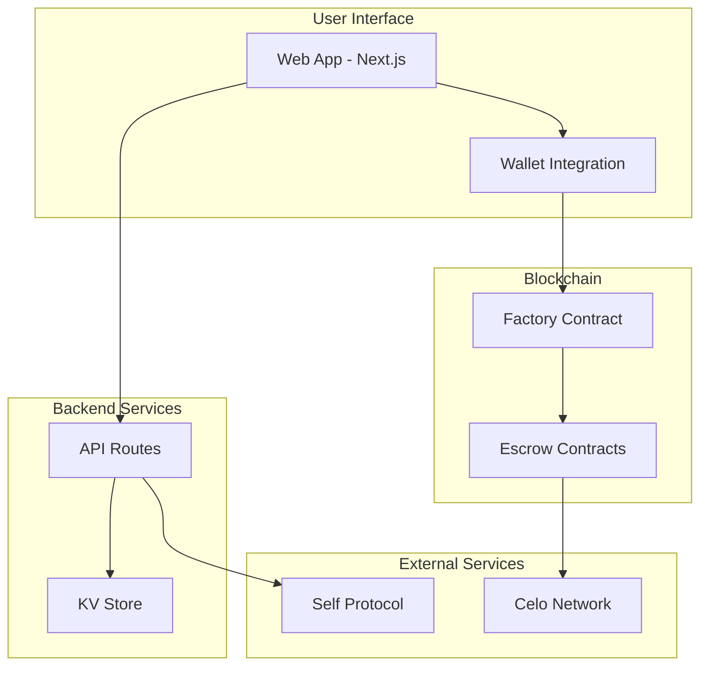
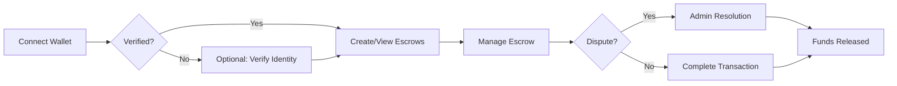

# Gigentic Escrow
## Product Requirements Document v1.6

### 🎯 Executive Summary

Gigentic Escrow is a decentralized escrow protocol built on Celo, designed for secure peer-to-peer transactions in emerging markets. The platform combines smart contract-based escrow with optional identity verification and admin-controlled dispute resolution, optimized for mobile users via MiniPay and Valora wallets.

**Core Value Proposition:** Enable trustless transactions between parties without traditional banking, with built-in dispute resolution and optional identity verification for enhanced trust.

---

## 🏗️ System Architecture

### High-Level Architecture

### Core Components

1. **Smart Contracts**: Factory pattern for deploying individual escrow instances
2. **Web Application**: Next.js-based interface with wallet integration
3. **API Layer**: Minimal backend for admin functions and verification
4. **Storage**: KV store for off-chain data (verification status and documents)
5. **Identity**: Self Protocol integration (frontend trust signal with no smart contract enforcement)

---

## 📋 Milestones & Deliverables

### Milestone 1: Smart Contract Foundation

**Deliverables:**
- Open-source GitHub repository
- Deployed factory and escrow contracts on Alfajores testnet
- Comprehensive test suite with high coverage
- Contract documentation

**Success Criteria:**
- All core escrow functions working (create, complete, dispute, resolve)
- Gas-optimized implementation
- Security best practices implemented

### Milestone 2: Platform Development

**Deliverables:**
- Deployed web application (production URL)
- Mobile-optimized responsive design
- Complete user flow implementation
- API endpoints for admin operations

**Success Criteria:**
- All user flows functional end-to-end
- Works on Valora and MiniPay browsers

### Milestone 3: Identity & Wallet Integration

**Deliverables:**
- Self Protocol verification integration (optional for users)
- Multi-wallet support (Valora, MiniPay, MetaMask)
- 10 documented pilot user tests
- Integration test suite

**Success Criteria:**
- Seamless wallet connection experience
- Verification flow completes in <60 seconds
- All pilot tests successful

### Milestone 4: Launch & Growth

**Deliverables:**
- Mainnet deployment (contract addresses published)
- Public API documentation
- 20 real users across 3 use cases
- Celo forum announcement post

**Success Criteria:**
- Zero critical bugs in production
- Successful transactions from real users
- Community engagement metrics met

---

## 🔄 User Flows

### Primary User Journey

### Key User Actions

1. **Create Escrow**: Specify recipient and amount in cUSD
2. **Complete Transaction**: Depositor releases funds to recipient
3. **Raise Dispute**: Either party can dispute with reason
4. **View Status**: Check escrow state and details
5. **Verify Identity**: Optional trust enhancement via Self Protocol

### Admin Actions

1. **Monitor Disputes**: View all active disputes
2. **Review Evidence**: Access dispute reasons and party details
3. **Resolve Disputes**: Decide fund distribution
4. **System Monitoring**: Track platform metrics

---

## 🛠️ Technical Stack

### Core Technologies

| Layer | Technology | Purpose |
|-------|------------|---------|
| **Smart Contracts** | Solidity 0.8.x | Escrow logic |
| **Blockchain** | Celo | Low-cost, mobile-first chain |
| **Frontend** | Next.js 14 | React framework with API routes |
| **Styling** | Tailwind CSS | Utility-first styling |
| **State Management** | React Context | Simple state management |
| **Wallet Connection** | Celo Composer Kit | Multi-wallet support |
| **Storage** | Upstash | Verification data and documents |
| **Hosting** | Vercel | Frontend and API hosting |

### Integration Points

- **Celo Network**: Smart contract deployment and interaction
- **cUSD Token**: Stable currency for escrow transactions
- **Self Protocol**: Identity verification service
- **Wallet Providers**: Valora, MiniPay, MetaMask

---

## 🎯 Use Cases

### Primary Use Cases

1. **Freelance Services**
   - Client deposits payment
   - Freelancer delivers work
   - Client releases payment

2. **P2P Marketplace**
   - Buyer deposits funds
   - Seller ships item
   - Buyer confirms receipt

3. **Service Deposits**
   - Customer pays deposit
   - Service provider delivers
   - Deposit released or refunded

---

## 📝 Related Documentation

For detailed implementation specifications, refer to:

- **Smart Contract Specification**: Technical contract details
- **Platform Architecture**: Detailed system design
- **Self Integration Specification**: Identity verification implementation
- **API Documentation**: Endpoint specifications
- **UI/UX Guidelines**: Design system and components

---

## ✅ Definition of Done

The Gigentic Escrow MVP is considered complete when:

1. ✅ All milestones delivered
2. ✅ 20+ real users successfully complete transactions
3. ✅ Documentation published and accessible
4. ✅ Mainnet contracts verified and running
5. ✅ Community announcement published

---

*This document serves as the primary reference for the Gigentic Escrow project. Implementation details are maintained in separate technical specifications to allow for flexibility during development while maintaining clear project goals and success criteria.*