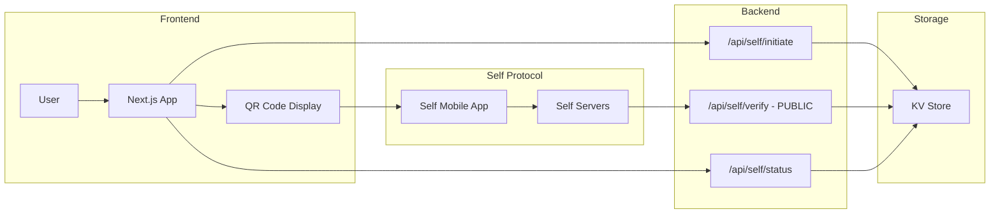
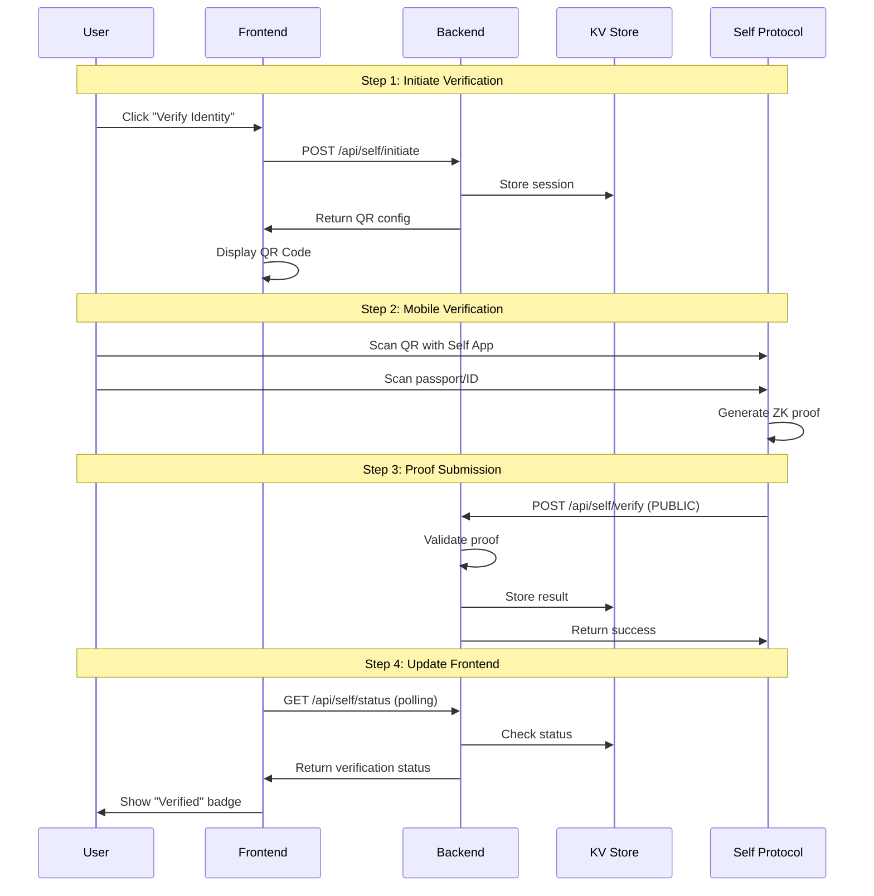

# Gigentic Escrow - Self Protocol Integration

## Core Architecture



## Self Protocol Verification Flow



## Minimal Implementation (3 Files)

### 1. Backend API Routes (`/pages/api/self/`)

```typescript
// /pages/api/self/initiate.ts
import { nanoid } from 'nanoid';

export default async function handler(req, res) {
  const { address } = req.body;
  
  const sessionId = nanoid();
  const qrConfig = {
    version: 2,
    appName: "Gigentic Escrow",
    scope: "gigentic-escrow",
    endpoint: `${process.env.NEXT_PUBLIC_URL}/api/self/verify`,
    endpointType: "staging_https", // or "https" for production
    userIdType: "hex",
    userId: address,
    userDefinedData: JSON.stringify({ sessionId, address }),
    disclosures: {
      minimumAge: 18,
      nationality: true,
      ofac: false
    }
  };
  
  // Store session
  await kv.set(`session:${sessionId}`, {
    address,
    status: 'pending',
    createdAt: Date.now()
  }, { ex: 600 }); // Expires in 10 minutes
  
  return res.json({ sessionId, qrConfig });
}
```

```typescript
// /pages/api/self/verify.ts (MUST BE PUBLIC)
import { SelfBackendVerifier } from '@selfxyz/core';

const verifier = new SelfBackendVerifier(
  "gigentic-escrow",
  process.env.NEXT_PUBLIC_URL + "/api/self/verify",
  false, // production mode
  AllIds,
  configStore,
  "hex"
);

export default async function handler(req, res) {
  const { attestationId, proof, publicSignals, userContextData } = req.body;
  
  try {
    // Parse context to get session/address
    const context = JSON.parse(userContextData);
    
    // Verify the ZK proof
    const result = await verifier.verify(
      attestationId,
      proof,
      publicSignals,
      userContextData
    );
    
    if (result.isValidDetails.isValid) {
      // Store verification for this wallet
      await kv.set(`verified:${context.address}`, {
        verified: true,
        nationality: result.discloseOutput.nationality,
        timestamp: Date.now()
      });
      
      // Update session
      await kv.set(`session:${context.sessionId}`, {
        status: 'completed',
        completedAt: Date.now()
      });
      
      return res.json({ success: true });
    }
    
    return res.status(400).json({ error: 'Invalid proof' });
  } catch (error) {
    console.error('Verification error:', error);
    return res.status(500).json({ error: 'Verification failed' });
  }
}
```

```typescript
// /pages/api/self/status/[address].ts (PUBLIC - Basic Status)
export default async function handler(req, res) {
  const { address } = req.query;
  
  // Public endpoint - anyone can check if an address is verified
  const verification = await kv.get(`verified:${address}`);
  
  // Only return verification status, not personal details
  return res.json({
    verified: !!verification,
    verifiedAt: verification?.timestamp || null
    // Explicitly NOT returning nationality or other PII
  });
}

// Optional: /pages/api/self/details/[address].ts (PROTECTED - Full Details)
// Only for the wallet owner themselves or admin in dispute cases
export default async function handler(req, res) {
  const { address } = req.query;
  const requestingAddress = req.headers['x-wallet-address']; // From auth
  
  // Only the wallet owner or admin can see full details
  const isOwner = requestingAddress?.toLowerCase() === address.toLowerCase();
  const isAdmin = await checkIsAdmin(requestingAddress);
  
  if (!isOwner && !isAdmin) {
    return res.status(403).json({ error: 'Unauthorized' });
  }
  
  const verification = await kv.get(`verified:${address}`);
  
  return res.json({
    verified: !!verification,
    data: verification || null // Full data including nationality
  });
}
```

### 2. Frontend Component

```typescript
// components/SelfVerification.tsx
import { useState, useEffect } from 'react';
import { SelfQRcodeWrapper, SelfAppBuilder } from '@selfxyz/qrcode';

export function SelfVerification({ address, onSuccess }) {
  const [qrConfig, setQrConfig] = useState(null);
  const [sessionId, setSessionId] = useState(null);
  const [status, setStatus] = useState('idle');
  
  const startVerification = async () => {
    const res = await fetch('/api/self/initiate', {
      method: 'POST',
      headers: { 'Content-Type': 'application/json' },
      body: JSON.stringify({ address })
    });
    
    const data = await res.json();
    setQrConfig(data.qrConfig);
    setSessionId(data.sessionId);
    setStatus('pending');
    
    // Start polling
    pollForCompletion(data.sessionId);
  };
  
  const pollForCompletion = (sessionId) => {
    const interval = setInterval(async () => {
      const res = await fetch(`/api/self/status/${address}`);
      const data = await res.json();
      
      if (data.verified) {
        clearInterval(interval);
        setStatus('verified');
        onSuccess(data);
      }
    }, 2000);
    
    // Clean up after 10 minutes
    setTimeout(() => clearInterval(interval), 600000);
  };
  
  const selfApp = qrConfig ? new SelfAppBuilder(qrConfig).build() : null;
  
  if (status === 'idle') {
    return (
      <button onClick={startVerification}>
        Verify Identity
      </button>
    );
  }
  
  if (status === 'pending' && selfApp) {
    return (
      <div>
        <h3>Scan with Self App</h3>
        <SelfQRcodeWrapper
          selfApp={selfApp}
          onSuccess={() => console.log('Scanned')}
        />
        <p>Waiting for verification...</p>
      </div>
    );
  }
  
  if (status === 'verified') {
    return <div>✅ Verified</div>;
  }
}
```

### 3. Usage in Escrow

```typescript
// Component to display any user's verification status
function VerificationBadge({ address }) {
  const [status, setStatus] = useState(null);
  
  useEffect(() => {
    // Public endpoint - no auth needed
    fetch(`/api/self/status/${address}`)
      .then(res => res.json())
      .then(data => setStatus(data));
  }, [address]);
  
  if (!status) return null;
  
  return status.verified ? (
    <span className="verified-badge">
      ✅ Verified
    </span>
  ) : (
    <span className="unverified">
      Not verified
    </span>
  );
}

// In your escrow details view
function EscrowDetails({ escrow }) {
  return (
    <div>
      <h3>Escrow between:</h3>
      <div>
        <span>Depositor: {escrow.depositor}</span>
        <VerificationBadge address={escrow.depositor} />
      </div>
      <div>
        <span>Recipient: {escrow.recipient}</span>
        <VerificationBadge address={escrow.recipient} />
      </div>
      
      {/* Users can see verification status of counterparty */}
      {/* Helps them make informed trust decisions */}
    </div>
  );
}

// In your own profile/dashboard
function MyProfile() {
  const { address } = useAccount();
  const [isVerified, setIsVerified] = useState(false);
  
  useEffect(() => {
    fetch(`/api/self/status/${address}`)
      .then(res => res.json())
      .then(data => setIsVerified(data.verified));
  }, [address]);
  
  return (
    <div>
      {!isVerified ? (
        <SelfVerification 
          address={address}
          onSuccess={() => setIsVerified(true)}
        />
      ) : (
        <div>✅ You are verified</div>
      )}
    </div>
  );
}
```

## What You're Actually Storing

```typescript
// In KV Store
{
  // Temporary session (expires after 10 min)
  "session:abc123": {
    address: "0x742d...",
    status: "pending",
    createdAt: 1234567890
  },
  
  // Permanent verification (per wallet)
  "verified:0x742d...": {
    verified: true,
    nationality: "US",
    timestamp: 1234567890
  }
}
```

## Privacy Model & Rationale

### Why Public Verification Status?

In an escrow platform, trust signals need to be visible to be useful. If users can't see that their counterparty is verified, the verification loses its purpose. Think of it like:

- **eBay seller ratings**: Public trust signal
- **Twitter blue checks**: Public verification 
- **Airbnb host verification**: Visible to all users

### What's Public vs Private

| Data | Visibility | Rationale |
|------|------------|-----------|
| **Verification Status** | Public | Trust signal for escrow decisions |
| **Verification Date** | Public | Shows recency, builds confidence |
| **Nationality/Country** | Private | Personal info, only for disputes |
| **Other PII** | Never stored | Privacy by design |

### Simple Implementation for Pilot

For your pilot, keep it simple:
- **One public endpoint**: `/api/self/status/[address]` returns `{verified: true/false, verifiedAt: timestamp}`
- **No complex permissions**: Everyone can check anyone's verification status
- **Privacy preserved**: Personal details stay in KV store but aren't exposed

This approach:
✅ Makes sense for an escrow platform (trust needs visibility)  
✅ Protects user privacy (no PII exposed)  
✅ Simple to implement (one public endpoint)  
✅ Easy to extend later (can add protected details endpoint if needed)

## Security Rules

1. **Public Endpoints**: 
   - `/api/self/verify` - Self Protocol callback
   - `/api/self/status/[address]` - Basic verification check
2. **Protected Endpoint** (optional):
   - `/api/self/details/[address]` - Full details for owner/admin only
3. **No PII Storage**: Don't store names, DOB, passport numbers
4. **Rate Limiting**: Max 5 verification attempts per wallet per day
5. **Minimal Data Exposure**: Only expose what's needed for trust

## Environment Variables

```env
# .env.local
NEXT_PUBLIC_URL=https://your-app.vercel.app
UPSTASH_REDIS_REST_URL=...
UPSTASH_REDIS_REST_TOKEN=...
```

## That's It!

This is all you need for a working Self Protocol integration:
- 3 API endpoints (2 public, 1 for Self callback)
- 1 React component  
- Simple KV storage
- No smart contract changes
- No complex permission system
- Clear privacy model

### Why This Works for Your Pilot

1. **Trust is visible**: Users can see if counterparties are verified before entering escrows
2. **Privacy preserved**: No personal details exposed publicly
3. **Simple to implement**: Just boolean flags, no complex logic
4. **Easy to understand**: "Green check = verified" is universal UX
5. **Future-proof**: Can add more sophisticated privacy controls later if needed

For a pilot project, this strikes the right balance between functionality and simplicity. You're not trying to solve every edge case - you're proving that identity verification adds value to escrow transactions.
